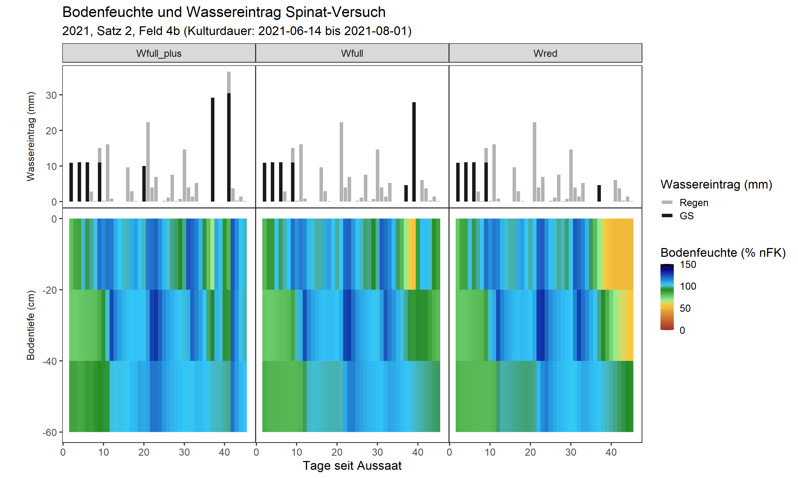
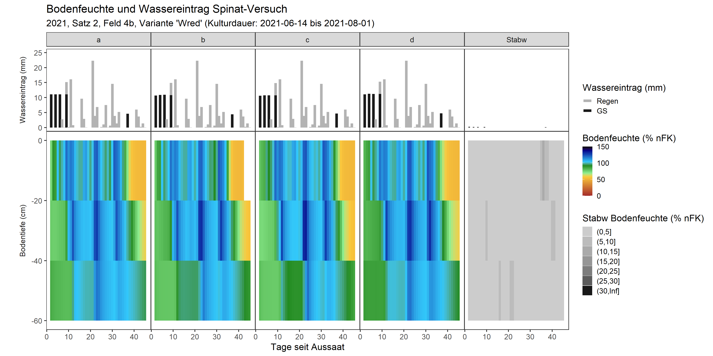
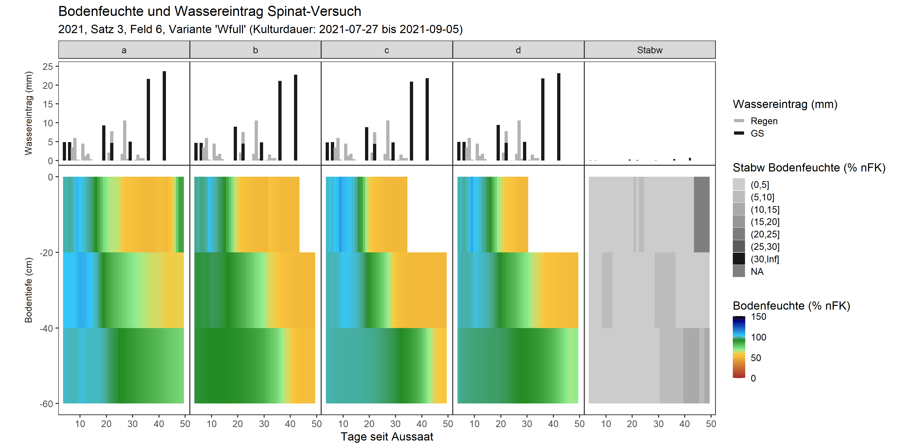

```{r setoptions, echo = FALSE, include=FALSE}
knitr::opts_chunk$set(warnings=FALSE, message = FALSE, cache=TRUE)
```

### Wasserhaltevermögen der Felder der HGU:
|Schicht Nr.|Bezeichnung|100%nFK entsprechen|"Wassergehalt (Vol.% bei 100%nFK)"|
|:---------:|:---------:|:-----------------:|:--------------------------------:|
|   1       |	0-30 cm	|       49.3 mm     |	            16.4%              |
|   2       |  30-60 cm |       46.1 mm     |	            15.4%              |
|   3       |  60-90 cm |       43.4 mm     |               14.5%              |

Daten unter "Z:\\Außenbetrieb\\Flächenbelegung\\Wasserhaltevermögen Böden Felder Gb.xlsx"


```{r , fig.align = 'center', out.width = "100%"}
knitr::include_graphics("../graphics/Feldkapazität_Thomas.png")
```
Figure 1: "Beziehung Volumetrischer Wassergehalt ~ Matrixpotential. Berechnungsgrundlage der nFK. Quelle: Thomas F. (2018) Ökophysiologische Leistungen der Höheren Pflanzen. In: Grundzüge der Pflanzenökologie. Springer Spektrum, Berlin, Heidelberg. https://doi.org/10.1007/978-3-662-54139-5_3"


```{r echo=FALSE, message=FALSE, warning=FALSE}
library(DBI)
library(data.table)
library(dtplyr)
library(dplyr)
library(ggplot2)
library(lubridate)
library(ggnewscale)
library(tidyr)
```

### Grenzwerte zur Berechnung der nutzbaren Feldkapazität
```{r}
pf_min <- 1.8
pf_max <- 4.2
hPa_min <- 10^pf_min
hPa_max <- 10^pf_max
# Vol% Wasser bei 100% nFK für drei Bodentiefen:
T0020 <- 49.3
T4060 <- 46.1
T2040 <- T0020 - (T0020 - T4060) / 2
```

### Tensiometer-Daten, Wetter und Bewasserung aus SQLite-Datenbank lesen.
```{r}
# Verbindung zur Datenbanl herstellen:
path1 <- ifelse(Sys.info()["nodename"] == "Samanthas-MacBook-Pro.local",
                "../../Github_GeoSenSys/GeoSenSys2020/", "../../GeoSenSys2020/"
)  
db <- paste0(path1, "Data_2020/HGU_GeoSenSys_V3_6.db") # DB in other R-Project

db1 <- dbConnect(RSQLite::SQLite(), db)

# Query fuer Tensiometer-Datensatz
query <- "SELECT
        Spinat_Saetze.satz_id,
      --  Varianten.variante_acronym,
        Varianten.variante_H2O,
        Parzellen.wiederholung,
        Tensiometer.zeit_messung,
        Tensiometer.bodensaugspannung_0020_hPa,
        Tensiometer.bodensaugspannung_2040_hPa,
        Tensiometer.bodensaugspannung_4060_hPa

        FROM Tensiometer
        LEFT JOIN Parzellen ON Tensiometer.parzelle_id = Parzellen.parzelle_id
        LEFT JOIN Varianten ON Parzellen.variante_id = Varianten.variante_id
        LEFT JOIN Spinat_Saetze ON Varianten.satz_id = Spinat_Saetze.satz_id
        WHERE Varianten.variante_N = 'N100'
        ;" #zunächst nur fuer Stickstoff-vollversorgte Varianten
tensio <- dbGetQuery(db1, query)


#### Query fuer Wetter-Daten:
query2 <- "SELECT
        Wetter.satz_id,
        Wetter.datum_wetter,
        Wetter.niederschlag_mm
        FROM
        Wetter"


wetter <- dbGetQuery(db1, query2) %>% # Niederschlag aller Saetze einlesen
    mutate_at("datum_wetter", ~ as_date(.))

# Query fuer Bewaesserungs-Datensatz
query3 <- "SELECT
        Spinat_Saetze.satz_id,
       -- Varianten.variante_acronym,
        Varianten.variante_H2O,
        Parzellen.wiederholung,
        Bewaesserung.datum_bewaesserung,
        Bewaesserung.wassermengen_mm

        FROM Bewaesserung
        LEFT JOIN Parzellen ON Bewaesserung.parzelle_id = Parzellen.parzelle_id
        LEFT JOIN Varianten ON Parzellen.variante_id = Varianten.variante_id
        LEFT JOIN Spinat_Saetze ON Varianten.satz_id = Spinat_Saetze.satz_id
        WHERE Varianten.variante_N = 'N100'
        "
bewaesserung <- dbGetQuery(db1, query3) %>% # Bewaesserung aller Saetze einlesen
    mutate_at("datum_bewaesserung", ~ as_date(.)) %>%
    rename(bewaesserung_mm = wassermengen_mm)


query4 <- "SELECT
        satz_id,
        datum_aussaat,
        datum_ernte
        FROM Spinat_saetze;"
saetze_ausaat <- dbGetQuery(db1, query4) %>% # Aussaat- und Erte-Datum aller Saetze einlesen
    mutate_at(c("datum_aussaat", "datum_ernte"), ~ as_date(.))


dbDisconnect(db1) # Verbindung zur Datenbank beenden
rm(db, db1, path1, query, query2, query3, query4) # Helfer-Objekte loeschen
```

### Daten formatieren und Tagesmittelwerte der Bodensaugspannung berechnen
```{r}
tensio <- tensio %>%
    # Datum formatieren und Tagesmittelwerte bilden
    mutate_at("zeit_messung", ~ as_datetime(.) %>%
                  format.Date(., format = "%Y-%m-%d") %>% # für Tages-Mittelwert
                  as_date(.)) %>% # wieder in Datum (class) umformen
    # Faktorstufen sortieren (für Grafik)
    mutate_at("variante_H2O", ~ factor(., levels = c("Wfull_plus", "Wfull", "Wred"))) %>%
    group_by(satz_id, variante_H2O, wiederholung, zeit_messung) %>%
    summarise_at(c(
        "bodensaugspannung_0020_hPa",
        "bodensaugspannung_2040_hPa",
        "bodensaugspannung_4060_hPa"
    ), ~ round(mean(., na.rm = TRUE), digits = 2))
```

###"Tage seit Aussaat" anfuegen
```{r}
saetze_ausaat <- tensio %>% group_by(satz_id) %>%
    summarise(datum_min = min(zeit_messung, na.rm = TRUE)) %>% 
    left_join(saetze_ausaat, by="satz_id") %>%
    mutate(tage_verzug = datum_min - datum_aussaat) 

tensio <- tensio %>% group_by(satz_id, variante_H2O, wiederholung) %>%
    mutate(tage_seit_aussaat = c(1,diff(zeit_messung)),  .after = zeit_messung) %>%
    mutate_at("tage_seit_aussaat", ~cumsum(.)) %>%
    left_join(saetze_ausaat %>% select(satz_id,tage_verzug)) %>%
    mutate_at("tage_seit_aussaat", ~as.numeric(.+tage_verzug)) %>%
    select(-tage_verzug)
```

#Korrektur der Wassersäule im Tensiometer:
<!-- Anleitung des Herstellers: https://pronova.de/neusale/neu/1249/bambach-stecktensiometer-premium -->
<!-- ```{r} -->
<!-- tensio <- tensio %>% -->
<!--     mutate( -->
<!--         bodensaugspannung_0020_hPa = bodensaugspannung_0020_hPa -20, #-cm Wassersäule -->
<!--         bodensaugspannung_2040_hPa = bodensaugspannung_2040_hPa -40, #-cm Wassersäule -->
<!--         bodensaugspannung_4060_hPa = bodensaugspannung_4060_hPa -60  #-cm Wassersäule -->
<!--     ) %>% -->
<!--     mutate_at(c("bodensaugspannung_0020_hPa",  -->
<!--                 "bodensaugspannung_2040_hPa",  -->
<!--                 "bodensaugspannung_4060_hPa"), ~ifelse(.<0,1,.)) #nicht 0, da sonst -Inf bei log -->
<!-- ``` -->


### hPa in pf umwandeln: log10(hPa)
```{r}
tensio <- tensio %>%
    mutate(
        pf_0020 = log10(bodensaugspannung_0020_hPa),
        pf_2040 = log10(bodensaugspannung_2040_hPa),
        pf_4060 = log10(bodensaugspannung_4060_hPa)
    )
```

### nFK berechnen
```{r}
nfk_fun <- function(x) {
    (1 - (x - pf_min) / (pf_max - pf_min)) * 100
}
tensio <- tensio %>% # as_tibble() %>%
    mutate_at(
        c("pf_0020", "pf_2040", "pf_4060"),
        list(nFK = nfk_fun)
    ) %>%
    rename_with(.cols = ends_with("_nfK"), ~ gsub("pf_", "T", .x, fixed = TRUE)) %>%
    # Tabelle komprimieren: 2 Nachkommastellen
    mutate_if(is.numeric, ~ round(., 2))
```


### Tabelle formatieren für ggplot
```{r}
tensio_melted <- tidyr::pivot_longer(tensio %>%
                                         select(c(
                                             "satz_id", "variante_H2O","wiederholung", 
                                             "zeit_messung", "tage_seit_aussaat",
                                             "T0020_nFK", "T2040_nFK", "T4060_nFK"
                                         )),
                                     cols = c("T0020_nFK", "T2040_nFK", "T4060_nFK"),
                                     names_to = "Bodentiefe",
                                     values_to = "nFK_prozent"
) %>%
    mutate(Bodentiefe = substr(Bodentiefe, 4, 5) %>% as.numeric()) %>%
    mutate(kategorie = factor("nFK", levels = c("wasserinput", "nFK")))
```

#Tensio bei 0cm erweitern
```{r}
# tensio0 <- tensio_melted %>%
#     filter(Bodentiefe == 20) %>%
#     mutate(Bodentiefe = 0)
# 
# tensio_melted <- bind_rows(tensio_melted, tensio0)
# 
# rm(tensio0)
```


### Wetter- und Bewässerungsdaten formatieren und zusammenführen
```{r}
# Bewaesserung und Niederschlag in eine Tabelle zusammenfuehren
wasser_gesamt <- tensio %>%
    select(satz_id, variante_H2O, wiederholung, zeit_messung, tage_seit_aussaat) %>%
    left_join(wetter, by = c("satz_id","zeit_messung" = "datum_wetter")) %>%
    left_join(bewaesserung, by = c("satz_id", "variante_H2O","wiederholung",
                                   "zeit_messung" = "datum_bewaesserung"
    )) %>%
    # Faktorstufen sortieren (für Grafik)
    tidyr::pivot_longer(
        cols = c("bewaesserung_mm", "niederschlag_mm"),
        names_to = "variable", values_to = "value"
    ) %>%
    mutate(kategorie = factor("wasserinput", levels = c("wasserinput", "nFK"))) %>%
    mutate_at("variante_H2O", ~ factor(., levels = c("Wfull_plus", "Wfull", "Wred")))


#stacked values anfuegen fuer plot:
stacked_bars_plot <- function(data, gruppen){
    data %>% 
        group_by_at(vars(gruppen)) %>%
        mutate_at("value", ~ifelse(is.na(.), 0, .)) %>% 
        mutate(value_stacked = cumsum(value)) %>% 
        mutate(value_min = ifelse(variable == "bewaesserung_mm", 0, value[1])) %>% 
        mutate_at(c("value_stacked", "value_min"),~ifelse( value == 0, NA, .)) %>%
        ungroup()
}

wasser_gesamt <- stacked_bars_plot(
    data = wasser_gesamt, 
    gruppen = c("kategorie", "satz_id", "variante_H2O",
                "wiederholung", "zeit_messung", "tage_seit_aussaat")
)
```

#Standardabweichung der Wiederholung
###Daten
```{r}
tensio_sd <- tensio_melted %>% 
    pivot_wider(id_cols = c("kategorie", 
                            "satz_id", "variante_H2O",##
                            "zeit_messung", "tage_seit_aussaat", "Bodentiefe"), 
                names_from = "wiederholung", values_from = "nFK_prozent") %>%
    rowwise() %>%
    mutate(nfK_sd = sd(c(a,b,c,d), na.rm = TRUE)) %>% 
    select(-a, -b, -c, -d) %>%
    ungroup

wasser_gesamt_sd <- wasser_gesamt %>% 
    filter(variable != "niederschlag_mm")  %>% 
    #niederschlag_mm ausschließen, da alle Wiederholungen gleich.
    pivot_wider(id_cols = c("kategorie",
                            "satz_id", "variante_H2O", ##
                            "variable", "zeit_messung", "tage_seit_aussaat"), 
                names_from = "wiederholung", values_from = "value") %>%
    rowwise() %>%
    mutate(wasser_sd = sd(c(a,b,c,d), na.rm = TRUE)) %>% 
    mutate_at("wasser_sd", ~ifelse(.==0, NA,.)) %>%
    select(-a, -b, -c, -d) %>%
    ungroup
```


#Funktionen für nFK-Plot aus Skript sourcen:
```{r}
source("../scripts/nfk_plot_functions.R")
```


```{r}
#Beispiel:
plot_nfk(satz_nr = 5, subtitle = "2021, Satz 3, Feld 6", wdh = FALSE, grafik = NULL) #grafik = "smooth")
plot_nfk(satz_nr = 3, subtitle = "2021, Satz 1, Feld 6, Variante 'Wred'", 
         wdh = TRUE, variante = "Wred", grafik = "smooth")
```


#Plot-Funktion ausfuehren
```{r}
#c("smooth", NULL)
#grafik <- "smooth" #NULL #fuer 20cm-Schritte.
grafik <- NULL
```

```{r message=FALSE, eval=FALSE}
p2 <- plot_nfk(satz_nr = 2, subtitle = "2020, Satz 2, Feld 4a (*Paper)", wdh = FALSE, grafik = grafik)
p3 <- plot_nfk(satz_nr = 3, subtitle = "2021, Satz 1, Feld 6", wdh = FALSE, grafik = grafik)
p4 <- plot_nfk(satz_nr = 4, subtitle = "2021, Satz 2, Feld 4b", wdh = FALSE, grafik = grafik)
p5 <- plot_nfk(satz_nr = 5, subtitle = "2021, Satz 3, Feld 6", wdh = FALSE, grafik = grafik)

p2; p3; p4; p5
```

#Grafik speichern
```{r message=FALSE, eval=FALSE}
# file_list <- list(
#     #file1 <- #keine Tensiometer-Daten fuer Satz 1
#     file2 = "../graphics/X20cm_Schritte/nFK_2020_Satz2.png",
#     file3 = "../graphics/X20cm_Schritte/nFK_2021_Satz1.png",
#     file4 = "../graphics/X20cm_Schritte/nFK_2021_Satz2.png",
#     file5 = "../graphics/X20cm_Schritte/nFK_2021_Satz3.png")
# 
# purrr::map2(file_list, list(p2, p3, p4, p5),
#             ~ggsave(filename = .x, plot = .y, device = "png", width = 10, height = 6, dpi = 300)
# )
```

\
<!-- \ -->
<!--  -->
<!-- \ -->
<!-- \ -->
<!--  -->
<!-- \ -->
<!-- \ -->
<!--  -->
<!-- \ -->
<!-- \ -->
<!--  -->

### Plots pro Variante (== Vergleich der Wiederholungen):
```{r}
#2020 Satz2: nur an zwei Stellen Tensiometer: keine Wiederholung.
```

```{r message=FALSE, eval=FALSE}
#2021 Satz1
p1 <- plot_nfk(satz_nr = 3, subtitle = "2021, Satz 1, Feld 6, Variante 'Wfull_plus'", 
               wdh = TRUE, variante = "Wfull_plus", grafik = grafik)
p2 <- plot_nfk(satz_nr = 3, subtitle = "2021, Satz 1, Feld 6, Variante 'Wfull'", 
               wdh = TRUE, variante = "Wfull", grafik = grafik)
p3 <- plot_nfk(satz_nr = 3, subtitle = "2021, Satz 1, Feld 6, Variante 'Wred'", 
               wdh = TRUE, variante = "Wred", grafik = grafik)
```

```{r message=FALSE, eval=FALSE}
#2021 Satz2
p4 <- plot_nfk(satz_nr = 4, subtitle = "2021, Satz 2, Feld 4b, Variante 'Wfull_plus'", 
               wdh = TRUE, variante = "Wfull_plus", grafik = grafik)
p5 <- plot_nfk(satz_nr = 4, subtitle = "2021, Satz 2, Feld 4b, Variante 'Wfull'", 
               wdh = TRUE, variante = "Wfull", grafik = grafik)
p6 <- plot_nfk(satz_nr = 4, subtitle = "2021, Satz 2, Feld 4b, Variante 'Wred'", 
               wdh = TRUE, variante = "Wred", grafik = grafik)
```

```{r message=FALSE, eval=FALSE}
#2021 Satz3
p7 <- plot_nfk(satz_nr = 5, subtitle = "2021, Satz 3, Feld 6, Variante 'Wfull_plus'", 
               wdh = TRUE, variante = "Wfull_plus", grafik = grafik)
p8 <- plot_nfk(satz_nr = 5, subtitle = "2021, Satz 3, Feld 6, Variante 'Wfull'", 
               wdh = TRUE, variante = "Wfull", grafik = grafik)
p9 <- plot_nfk(satz_nr = 5, subtitle = "2021, Satz 3, Feld 6, Variante 'Wred'", 
               wdh = TRUE, variante = "Wred", grafik = grafik)
```

#Grafiken der Wiederholung speichern
```{r message=FALSE, warning=FALSE, eval=FALSE}
# file_list <- list(
#     file1 = "../graphics/X20cm_Schritte/nFK_2021_Satz1_Wfull_plus.png",
#     file2 = "../graphics/X20cm_Schritte/nFK_2021_Satz1_Wfull.png",
#     file3 = "../graphics/X20cm_Schritte/nFK_2021_Satz1_Wred.png",
#     file4 = "../graphics/X20cm_Schritte/nFK_2021_Satz2_Wfull_plus.png",
#     file5 = "../graphics/X20cm_Schritte/nFK_2021_Satz2_Wfull.png",
#     file6 = "../graphics/X20cm_Schritte/nFK_2021_Satz2_Wred.png",
#     file7 = "../graphics/X20cm_Schritte/nFK_2021_Satz3_Wfull_plus.png",
#     file8 = "../graphics/X20cm_Schritte/nFK_2021_Satz3_Wfull.png",
#     file9 = "../graphics/X20cm_Schritte/nFK_2021_Satz3_Wred.png")
# 
# purrr::map2(file_list, list(p1,p2,p3,p4,p5,p6,p7,p8,p9),
#             ~ggsave(filename = .x, plot = .y, device = "png", width = 12, height = 6, dpi = 300)
# )
```

\

<!--  -->
<!--  -->
<!--  -->
<!--  -->
Wiederholung b, Bodentiefe: 40-60cm: Dies scheinen Fehlmessungen zu sein. Dafür spricht die hohe Stabw, sowie der Ausfall des Messgerätes nach Bodenfeuchtr-Werten < 140% nFK (maximale Werte aller Daten). Fuer eine weiter-Verwendung in ANNi wird diese Wiederholung aus dem Datensatz entfernt.

#Unplausible Tensiometer-Daten entfernen:
```{r}
tensio <- tensio %>%
    filter(satz_id !=4 | wiederholung != "b")
```


<!--  -->
<!--  -->
<!--  -->
<!--  -->
<!--  -->


#nFK-Tabelle speichern
```{r}
# file1 <- "../data/derived_data/nfK_2020_2021_20220311.csv"
# data.table::fwrite(x = tensio,file = file1, sep = ";", dec = ".")
```

#Bewässerung-Tabelle speichern
```{r}
# file1 <- "../data/derived_data/bewaesserung_2020_2021_20220311.csv"
# data.table::fwrite(x = bewaesserung,file = file1, sep = ";", dec = ".")
```

