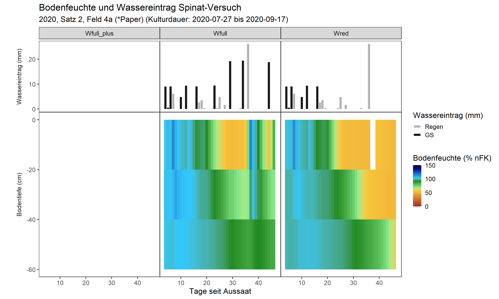
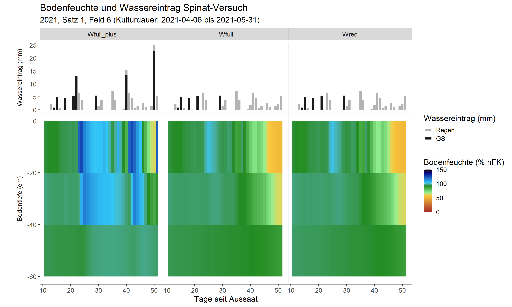
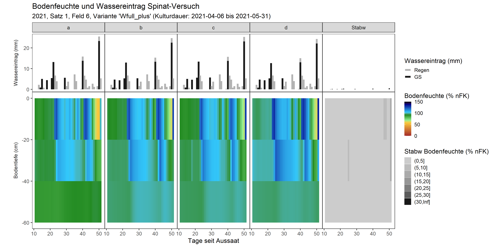
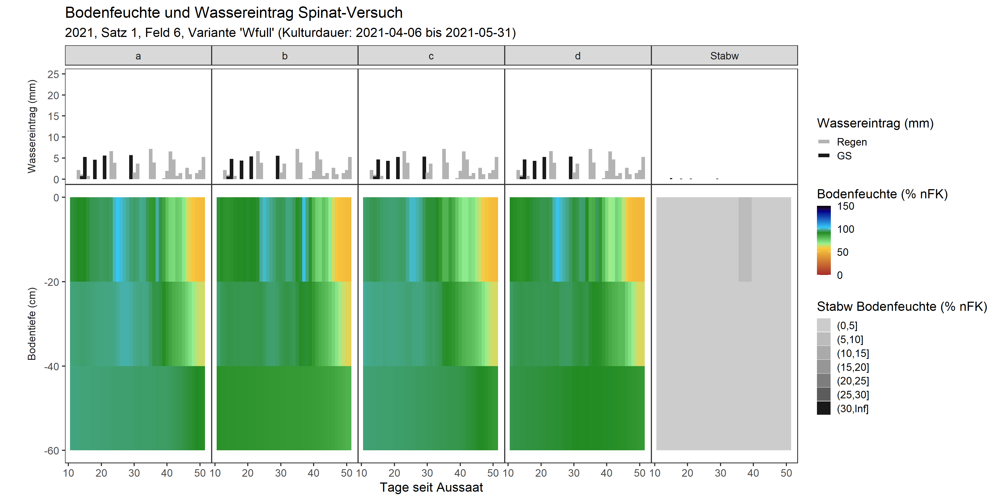
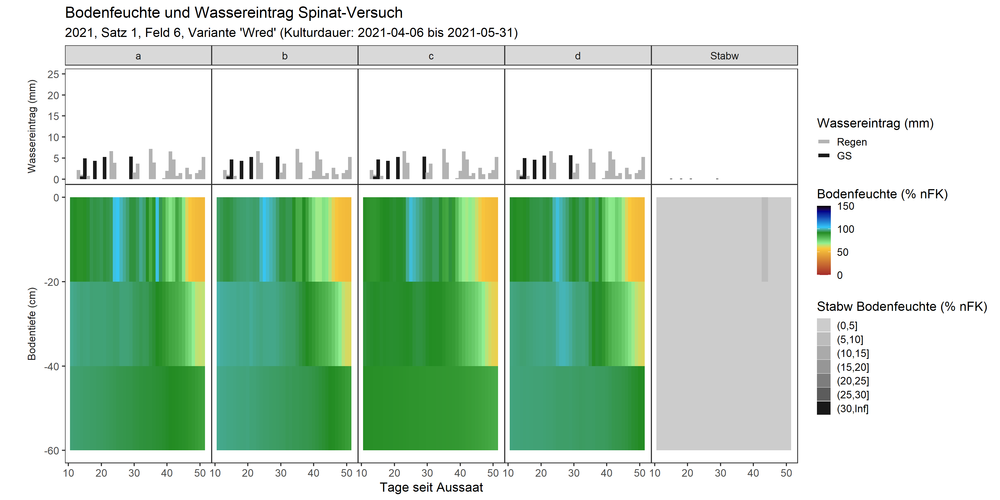
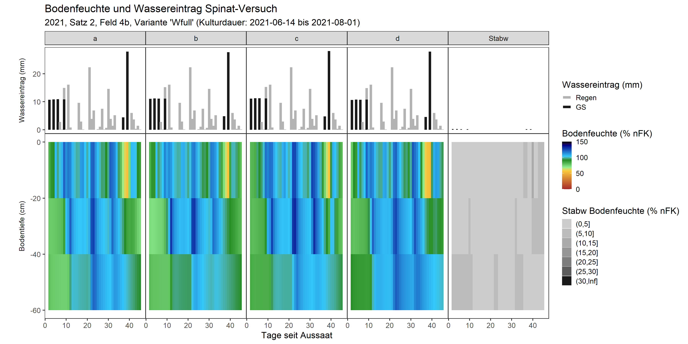
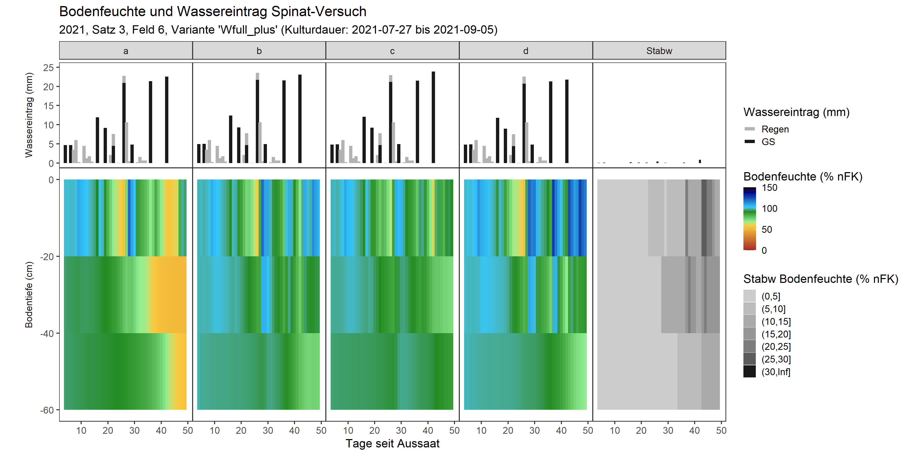
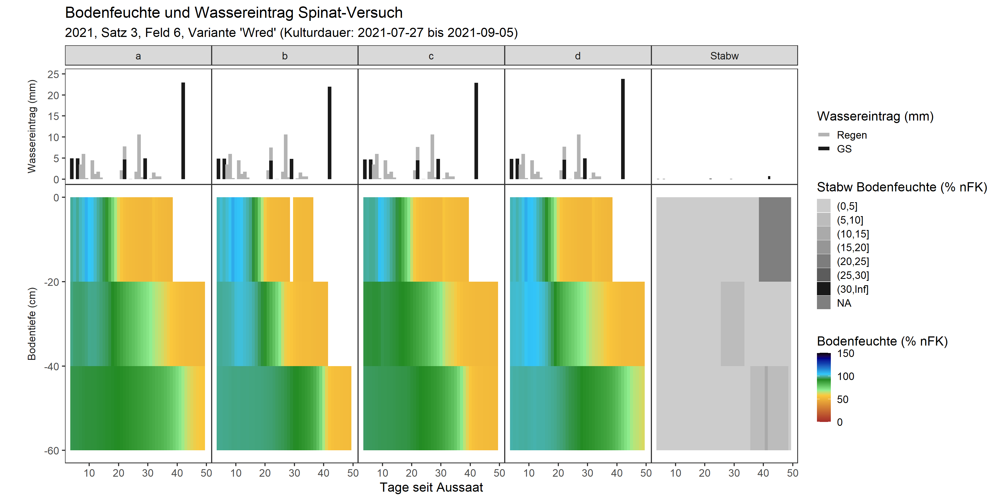

```{r setoptions, echo = FALSE, include=FALSE}
knitr::opts_chunk$set(warnings=FALSE, message = FALSE, cache=TRUE)
```

### Wasserhaltevermögen der Felder der HGU:
|Schicht Nr.|Bezeichnung|100%nFK entsprechen|"Wassergehalt (Vol.% bei 100%nFK)"|
|:---------:|:---------:|:-----------------:|:--------------------------------:|
|   1       |	0-30 cm	|       49.3 mm     |	            16.4%              |
|   2       |  30-60 cm |       46.1 mm     |	            15.4%              |
|   3       |  60-90 cm |       43.4 mm     |               14.5%              |

Daten unter "Z:\\Außenbetrieb\\Flächenbelegung\\Wasserhaltevermögen Böden Felder Gb.xlsx"


```{r , fig.align = 'center', out.width = "100%"}
knitr::include_graphics("../graphics/Feldkapazität_Thomas.png")
```
Figure 1: "Beziehung Volumetrischer Wassergehalt ~ Matrixpotential. Berechnungsgrundlage der nFK. Quelle: Thomas F. (2018) Ökophysiologische Leistungen der Höheren Pflanzen. In: Grundzüge der Pflanzenökologie. Springer Spektrum, Berlin, Heidelberg. https://doi.org/10.1007/978-3-662-54139-5_3"


```{r echo=FALSE, message=FALSE, warning=FALSE}
library(DBI)
library(data.table)
library(dtplyr)
library(dplyr)
library(ggplot2)
library(lubridate)
library(ggnewscale)
library(tidyr)
```

### Grenzwerte zur Berechnung der nutzbaren Feldkapazität
```{r}
pf_min <- 1.8
pf_max <- 4.2
hPa_min <- 10^pf_min
hPa_max <- 10^pf_max
# Vol% Wasser bei 100% nFK für drei Bodentiefen:
T0020 <- 49.3
T4060 <- 46.1
T2040 <- T0020 - (T0020 - T4060) / 2
```

### Tensiometer-Daten, Wetter und Bewasserung aus SQLite-Datenbank lesen.
```{r}
# Verbindung zur Datenbanl herstellen:
path1 <- ifelse(Sys.info()["nodename"] == "Samanthas-MacBook-Pro.local",
                "../../Github_GeoSenSys/GeoSenSys2020/", "../../GeoSenSys2020/"
)  
db <- paste0(path1, "Data_2020/HGU_GeoSenSys_V3_6.db") # DB in other R-Project

db1 <- dbConnect(RSQLite::SQLite(), db)

# Query fuer Tensiometer-Datensatz
query <- "SELECT
        Spinat_Saetze.satz_id,
      --  Varianten.variante_acronym,
        Varianten.variante_H2O,
        Parzellen.wiederholung,
        Tensiometer.zeit_messung,
        Tensiometer.bodensaugspannung_0020_hPa,
        Tensiometer.bodensaugspannung_2040_hPa,
        Tensiometer.bodensaugspannung_4060_hPa

        FROM Tensiometer
        LEFT JOIN Parzellen ON Tensiometer.parzelle_id = Parzellen.parzelle_id
        LEFT JOIN Varianten ON Parzellen.variante_id = Varianten.variante_id
        LEFT JOIN Spinat_Saetze ON Varianten.satz_id = Spinat_Saetze.satz_id
        WHERE Varianten.variante_N = 'N100'
        ;" #zunächst nur fuer Stickstoff-vollversorgte Varianten
tensio <- dbGetQuery(db1, query)


#### Query fuer Wetter-Daten:
query2 <- "SELECT
        Wetter.satz_id,
        Wetter.datum_wetter,
        Wetter.niederschlag_mm
        FROM
        Wetter"


wetter <- dbGetQuery(db1, query2) %>% # Niederschlag aller Saetze einlesen
    mutate_at("datum_wetter", ~ as_date(.))

# Query fuer Bewaesserungs-Datensatz
query3 <- "SELECT
        Spinat_Saetze.satz_id,
       -- Varianten.variante_acronym,
        Varianten.variante_H2O,
        Parzellen.wiederholung,
        Bewaesserung.datum_bewaesserung,
        Bewaesserung.wassermengen_mm

        FROM Bewaesserung
        LEFT JOIN Parzellen ON Bewaesserung.parzelle_id = Parzellen.parzelle_id
        LEFT JOIN Varianten ON Parzellen.variante_id = Varianten.variante_id
        LEFT JOIN Spinat_Saetze ON Varianten.satz_id = Spinat_Saetze.satz_id
        WHERE Varianten.variante_N = 'N100'
        "
bewaesserung <- dbGetQuery(db1, query3) %>% # Bewaesserung aller Saetze einlesen
    mutate_at("datum_bewaesserung", ~ as_date(.)) %>%
    rename(bewaesserung_mm = wassermengen_mm)


query4 <- "SELECT
        satz_id,
        datum_aussaat,
        datum_ernte
        FROM Spinat_saetze;"
saetze_ausaat <- dbGetQuery(db1, query4) %>% # Aussaat- und Erte-Datum aller Saetze einlesen
    mutate_at(c("datum_aussaat", "datum_ernte"), ~ as_date(.))


dbDisconnect(db1) # Verbindung zur Datenbank beenden
rm(db, db1, path1, query, query2, query3, query4) # Helfer-Objekte loeschen
```

### Daten formatieren und Tagesmittelwerte der Bodensaugspannung berechnen
```{r}
tensio <- tensio %>%
    # Datum formatieren und Tagesmittelwerte bilden
    mutate_at("zeit_messung", ~ as_datetime(.) %>%
                  format.Date(., format = "%Y-%m-%d") %>% # für Tages-Mittelwert
                  as_date(.)) %>% # wieder in Datum (class) umformen
    # Faktorstufen sortieren (für Grafik)
    mutate_at("variante_H2O", ~ factor(., levels = c("Wfull_plus", "Wfull", "Wred"))) %>%
    group_by(satz_id, variante_H2O, wiederholung, zeit_messung) %>%
    summarise_at(c(
        "bodensaugspannung_0020_hPa",
        "bodensaugspannung_2040_hPa",
        "bodensaugspannung_4060_hPa"
    ), ~ round(mean(., na.rm = TRUE), digits = 2))
```

###"Tage seit Aussaat" anfuegen
```{r}
saetze_ausaat <- tensio %>% group_by(satz_id) %>%
    summarise(datum_min = min(zeit_messung, na.rm = TRUE)) %>% 
    left_join(saetze_ausaat, by="satz_id") %>%
    mutate(tage_verzug = datum_min - datum_aussaat) 

tensio <- tensio %>% group_by(satz_id, variante_H2O, wiederholung) %>%
    mutate(tage_seit_aussaat = c(1,diff(zeit_messung)),  .after = zeit_messung) %>%
    mutate_at("tage_seit_aussaat", ~cumsum(.)) %>%
    left_join(saetze_ausaat %>% select(satz_id,tage_verzug)) %>%
    mutate_at("tage_seit_aussaat", ~as.numeric(.+tage_verzug)) %>%
    select(-tage_verzug)
```


### hPa in pf umwandeln: log10(hPa)
```{r}
tensio <- tensio %>%
    mutate(
        pf_0020 = log10(bodensaugspannung_0020_hPa),
        pf_2040 = log10(bodensaugspannung_2040_hPa),
        pf_4060 = log10(bodensaugspannung_4060_hPa)
    )
```

### nFK berechnen
```{r}
nfk_fun <- function(x) {
    (1 - (x - pf_min) / (pf_max - pf_min)) * 100
}
tensio <- tensio %>% # as_tibble() %>%
    mutate_at(
        c("pf_0020", "pf_2040", "pf_4060"),
        list(nFK = nfk_fun)
    ) %>%
    rename_with(.cols = ends_with("_nfK"), ~ gsub("pf_", "T", .x, fixed = TRUE)) %>%
    # Tabelle komprimieren: 2 Nachkommastellen
    mutate_if(is.numeric, ~ round(., 2))
```


### Tabelle formatieren für ggplot
```{r}
tensio_melted <- tidyr::pivot_longer(tensio %>%
                                         select(c(
                                             "satz_id", "variante_H2O","wiederholung", 
                                             "zeit_messung", "tage_seit_aussaat",
                                             "T0020_nFK", "T2040_nFK", "T4060_nFK"
                                         )),
                                     cols = c("T0020_nFK", "T2040_nFK", "T4060_nFK"),
                                     names_to = "Bodentiefe",
                                     values_to = "nFK_prozent"
) %>%
    mutate(Bodentiefe = substr(Bodentiefe, 4, 5) %>% as.numeric()) %>%
    mutate(kategorie = factor("nFK", levels = c("wasserinput", "nFK")))
```

#Tensio bei 0cm erweitern
```{r}
# tensio0 <- tensio_melted %>%
#     filter(Bodentiefe == 20) %>%
#     mutate(Bodentiefe = 0)
# 
# tensio_melted <- bind_rows(tensio_melted, tensio0)
# 
# rm(tensio0)
```


### Wetter- und Bewässerungsdaten formatieren und zusammenführen
```{r}
# Bewaesserung und Niederschlag in eine Tabelle zusammenfuehren
wasser_gesamt <- tensio %>%
    select(satz_id, variante_H2O, wiederholung, zeit_messung, tage_seit_aussaat) %>%
    left_join(wetter, by = c("satz_id","zeit_messung" = "datum_wetter")) %>%
    left_join(bewaesserung, by = c("satz_id", "variante_H2O","wiederholung",
                                   "zeit_messung" = "datum_bewaesserung"
    )) %>%
    # Faktorstufen sortieren (für Grafik)
    tidyr::pivot_longer(
        cols = c("bewaesserung_mm", "niederschlag_mm"),
        names_to = "variable", values_to = "value"
    ) %>%
    mutate(kategorie = factor("wasserinput", levels = c("wasserinput", "nFK"))) %>%
    mutate_at("variante_H2O", ~ factor(., levels = c("Wfull_plus", "Wfull", "Wred")))


#stacked values anfuegen fuer plot:
stacked_bars_plot <- function(data, gruppen){
    data %>% 
        group_by_at(vars(gruppen)) %>%
        mutate_at("value", ~ifelse(is.na(.), 0, .)) %>% 
        mutate(value_stacked = cumsum(value)) %>% 
        mutate(value_min = ifelse(variable == "bewaesserung_mm", 0, value[1])) %>% 
        mutate_at(c("value_stacked", "value_min"),~ifelse( value == 0, NA, .)) %>%
        ungroup()
}

wasser_gesamt <- stacked_bars_plot(
    data = wasser_gesamt, 
    gruppen = c("kategorie", "satz_id", "variante_H2O",
                "wiederholung", "zeit_messung", "tage_seit_aussaat")
)
```

#Standardabweichung der Wiederholung
###Daten
```{r}
tensio_sd <- tensio_melted %>% 
    pivot_wider(id_cols = c("kategorie", 
                            "satz_id", "variante_H2O",##
                            "zeit_messung", "tage_seit_aussaat", "Bodentiefe"), 
                names_from = "wiederholung", values_from = "nFK_prozent") %>%
    rowwise() %>%
    mutate(nfK_sd = sd(c(a,b,c,d), na.rm = TRUE)) %>% 
    select(-a, -b, -c, -d) %>%
    ungroup

wasser_gesamt_sd <- wasser_gesamt %>% 
    filter(variable != "niederschlag_mm")  %>% 
    #niederschlag_mm ausschließen, da alle Wiederholungen gleich.
    pivot_wider(id_cols = c("kategorie",
                            "satz_id", "variante_H2O", ##
                            "variable", "zeit_messung", "tage_seit_aussaat"), 
                names_from = "wiederholung", values_from = "value") %>%
    rowwise() %>%
    mutate(wasser_sd = sd(c(a,b,c,d), na.rm = TRUE)) %>% 
    mutate_at("wasser_sd", ~ifelse(.==0, NA,.)) %>%
    select(-a, -b, -c, -d) %>%
    ungroup
```

### nFK plotten
```{r}
nfk_interpolation <- function(.data, .gruppen=gruppen){
    a <- .data %>% ungroup 
        # Schichtmittelpunkte gewählt, statt 20cm-Schichtdicke
    B0cm <- a %>% filter(Bodentiefe == 10) %>% mutate(Bodentiefe = 0)
    B60cm <- a %>% filter(Bodentiefe == 50) %>% mutate(Bodentiefe = 60)
    
    #damit Fehlende Werte nur in den vorgesehenen Zeit- und Tiefenslots fehlen: 
    #ausfuellen mit tatsächlichen Werten
    a <- a %>% 
        pivot_wider(id_cols = .gruppen, names_from = "Bodentiefe", 
                    values_from ="nFK_prozent", names_prefix = "T" ) %>%
        mutate(T20 = ifelse(is.na(T10), T30,NA),
               T40 = ifelse(is.na(T50), T30,NA)) %>% 
        pivot_longer(cols = c("T10", "T20", "T30", "T40", "T50"),
                     names_to = "Bodentiefe", values_to = "nFK_prozent")%>% 
        filter(!is.na(nFK_prozent)|Bodentiefe %in% c(20,40)) %>%    
     mutate_at("Bodentiefe", ~substr(., 2,3) %>% as.numeric) %>%
        bind_rows(B0cm, B60cm)
    
    
    gruppen2 <- c(.gruppen[!grepl(x = .gruppen,  #fuer zweite interpolation (x-Achse) gruppieren
                                  pattern = c("zeit_messung|tage_seit_aussaat"))], #ohne diese
                  "Bodentiefe") #mit dieser Variable
    
    # a_interpoliert <- 
    a %>% arrange(Bodentiefe) %>% 
        group_by_at(.gruppen) %>%
        do(approx(x = .$Bodentiefe,
                  y = .$nFK_prozent, 
                  rule = 1, 
                  xout = seq(0,60,by=1), #pro 1 cm
        ) %>% as.data.frame) %>%
        rename(Bodentiefe = x, nFK_prozent = y) %>%
        group_by_at(gruppen2) %>% 
        do(approx(x = .$tage_seit_aussaat,
                  y = .$nFK_prozent, 
                  rule = 1, 
                  xout = seq(min(.$tage_seit_aussaat, na.rm = TRUE),
                             max(.$tage_seit_aussaat, na.rm = TRUE),by=0.1) #10 Punkte pro Tag
        ) %>% as.data.frame) %>%
        rename(tage_seit_aussaat = x, nFK_prozent = y) %>%
        ungroup
    
    #return(a_interpoliert)
}
```

###zunaechst Daten vorbereiten:
```{r}
# plot erstellen: #minus-Bodentiefe, da der Wert die "bis"-Bodentiefe beschreibt
daten_plot_nfk <- function(satz_nr=satz_nr, wdh = FALSE, variante = NULL, grafik = NULL) {
    #Konflikte mit Daten im Workspace vermeiden:
    tensio_melted2 <- tensio_melted %>% filter(satz_id == satz_nr & !is.na(nFK_prozent)) %>%
        mutate_at("Bodentiefe", ~.-10)
    wasser_gesamt2 <- wasser_gesamt %>% filter(satz_id == satz_nr) 
    saetze_ausaat2 <- saetze_ausaat %>% filter(satz_id == satz_nr)    
    
    #Plothoehe des Wassereintrages auf min 25 setzen. In X-Achsenskala ausblenden.
    add_for_plot_heigth <-  wasser_gesamt2 %>% 
        group_by(variante_H2O, wiederholung) %>% 
        slice(., 1) %>% 
        mutate(zeit_messung = as_date("1900-01-01"), 
               tage_seit_aussaat = -100, 
               value_stacked = 25)
    wasser_gesamt2 <- wasser_gesamt2 %>% bind_rows(add_for_plot_heigth)
    
    
    
    #Pro Variante oder einzeln fuer Wiederholung:
    if(isFALSE(wdh)) { #== Mittelwert aller Wiederholungen einer Variante
        gruppen <- c("kategorie", "satz_id", "variante_H2O",
                     "zeit_messung", "tage_seit_aussaat")
        
        tensio_melted2 <- tensio_melted2 %>% 
            group_by(kategorie, satz_id, variante_H2O, Bodentiefe, 
                     zeit_messung, tage_seit_aussaat) %>%
            summarise(nFK_prozent = mean(nFK_prozent, na.rm = TRUE)) %>%
            ungroup();
        
        wasser_gesamt2 <- wasser_gesamt2 %>% 
            group_by(kategorie, variable, satz_id, variante_H2O, 
                     zeit_messung, tage_seit_aussaat) %>%
            summarise(value = mean(value, na.rm = TRUE)) %>%
            ungroup() %>%
            stacked_bars_plot(gruppen = gruppen);    
        
        
    } else { #== Wiederholungen einer Variante vergleichen
        gruppen <- c("kategorie", "satz_id", "variante_H2O",
                     "wiederholung", "zeit_messung", "tage_seit_aussaat")
        tensio_melted2 <- tensio_melted2 %>% filter(variante_H2O == variante);
        wasser_gesamt2 <- wasser_gesamt2 %>% filter(variante_H2O == variante);
        
        #SD-Daten
        wasser_gesamt_sd2 <- wasser_gesamt_sd %>%  
            filter(satz_id == satz_nr & variante_H2O == variante) %>%
            mutate(wiederholung = "Stabw")
        
        tensio_sd2 <- tensio_sd %>%  
            filter(satz_id == satz_nr & variante_H2O == variante) %>%
            mutate(wiederholung = "Stabw") %>%
            mutate_at("Bodentiefe", ~.-10)
        
        #Farben des SD-Plots (Grau-Skala)
        my_breaks_sd <- c(seq(from = 0, to = 30, by = 5), Inf);
        my_colors_sd <- grey.colors(7, start = 0.1, end = 0.8, rev = TRUE);
        my_labels_sd <- levels(cut(tensio_sd2$nfK_sd, breaks = my_breaks_sd))
        
        tensio_sd2 <- tensio_sd2 %>% mutate_at("nfK_sd", ~cut(., my_breaks_sd))
        
        wdh_list <- list(
            wasser_gesamt_sd2 = wasser_gesamt_sd2,
            tensio_sd2=tensio_sd2,
            my_breaks_sd=my_breaks_sd,
            my_colors_sd=my_colors_sd,
            my_labels_sd=my_labels_sd)
    }
    
    
    
    ##Tabelle fuer Interpolation definieren:
    if(grafik == "smooth"){
        tensio_melted2 <- tensio_melted2 %>% nfk_interpolation(.gruppen = gruppen)
    }
    
    
    #Farbspektrum definieren für nFK:
    my_breaks <- c(seq(from = 0, to = 120, by = 10), Inf)
    my_colors <- c(
        colorRampPalette(c("brown", "#fac83c"))(6),
        colorRampPalette(c("lightgreen", "forestgreen"))(3),
        colorRampPalette(c("#32c8fa", "darkblue"))(4)
    )
    my_labels <- levels(cut(tensio_melted$nFK_prozent, breaks = my_breaks))
    
    basic_list <- list(tensio_melted2=tensio_melted2,
                       wasser_gesamt2=wasser_gesamt2,
                       saetze_ausaat2=saetze_ausaat2,
                       my_breaks=my_breaks,
                       my_colors=my_colors,
                       my_labels=my_labels)
    
    list_output <- if(isTRUE(wdh)){c(basic_list, wdh_list)} else {basic_list}
    
    return(list_output)
    
}
```


<!-- Interpolation: -->
<!-- ```{r} -->
<!-- a <- tensio_melted %>% ungroup %>%  -->
<!--   filter(satz_id == 4, variante_H2O == "Wfull_plus", wiederholung =="b")  %>%  -->
<!--   mutate(Bodentiefe = Bodentiefe-10) # Schichtmittelpunkte gewählt, statt 20cm-Schichtdicke -->
<!-- B0cm <- a %>% filter(Bodentiefe == 10) %>% mutate(Bodentiefe = 0) -->
<!-- B60cm <- a %>% filter(Bodentiefe == 50) %>% mutate(Bodentiefe = 60) -->


<!-- a <- bind_rows(a, B0cm, B60cm) -->
<!-- max_nfk <- max(a$nFK_prozent, na.rm = TRUE) -->

<!-- rm(B0cm, B60cm) -->
<!-- ``` -->

<!-- ```{r} -->
<!-- a_interpoliert <- a %>% arrange(Bodentiefe) %>%  -->
<!--   group_by(kategorie, satz_id, variante_H2O, wiederholung, zeit_messung, tage_seit_aussaat) %>% -->
<!--   do(approx(x = .$Bodentiefe, -->
<!--             y = .$nFK_prozent,  -->
<!--             rule = 1,  -->
<!--             xout = seq(0,60,by=1), #pro 1 cm -->
<!--   ) %>% as.data.frame) %>% -->
<!--   rename(Bodentiefe = x, nFK_prozent = y) %>% -->
<!--   group_by(kategorie, satz_id, variante_H2O, wiederholung, Bodentiefe) %>%  -->
<!--   do(approx(x = .$tage_seit_aussaat, -->
<!--             y = .$nFK_prozent,  -->
<!--             rule = 1,  -->
<!--             xout = seq(min(a$tage_seit_aussaat, na.rm = TRUE), -->
<!--                        max(a$tage_seit_aussaat, na.rm = TRUE),by=0.1), #10 Punkte pro Tag -->
<!--   ) %>% as.data.frame) %>% -->
<!--   rename(tage_seit_aussaat = x, nFK_prozent = y) %>% -->
<!--   ungroup -->

<!-- a_interpoliert -->
<!-- ``` -->
```{r}
# ggplot() + geom_raster(data=a_interpoliert, 
#                        aes(x=tage_seit_aussaat, y=-Bodentiefe, fill=nFK_prozent))+
#     scale_fill_gradient2(low = "red", mid = "green", high = "blue")
```


```{r}
plot_smooth <- function(data = list1, grafik = NULL){
    if(grafik=="smooth"){
        geom_raster(data = data$tensio_melted2, 
                    aes(x=tage_seit_aussaat, y=-Bodentiefe, fill=nFK_prozent))
    } else if(is.null(grafik)){
        geom_tile(data = data$tensio_melted2,
                  aes(x = tage_seit_aussaat, y = -(Bodentiefe), fill = nFK_prozent,
                      width = 1, height = 20), na.rm = TRUE) 
    }
    
}
```


```{r}
plot_nfk <- function(satz_nr, subtitle, wdh = FALSE, variante = NULL, grafik=NULL) {
    
    #Daten von oben als Liste erhalten:
    list1 <- daten_plot_nfk(satz_nr = satz_nr, wdh = wdh, variante = variante, grafik = grafik)
    attach(list1) #damit auf die Tabellen per Name zugegriffen werden kann.
    
    
    #gg-Plot-Funktion:
    p <- ggplot() +
        # nFK anfügen:
        # geom_contour_filled(
        #     data = tensio_melted2,
        #     aes(x = tage_seit_aussaat, y = -(Bodentiefe), z = nFK_prozent),
        #     breaks = my_breaks, 
        # ) +
        # scale_fill_manual("Bodenfeuchte (% nFK)",
        #                       values = my_colors, 
        #                       labels = my_labels, 
        #                       drop = FALSE
        #     ) +
    # "drop = FALSE" ist notwendig um auch Werte anzuzeigen (und die Farben zu scalen),
    # die nicht ueber den Wertebereich in der CSV hinausgehen (z.B. <10 oder >120 % nFK)
    
    
    plot_smooth(data = list1, grafik = grafik) + 
        
        
        scale_fill_gradientn("Bodenfeuchte (% nFK)",
                             colours = c(my_colors, "black"), 
                             values = scales::rescale(c(1:(length(my_colors)+1)), 
                                                      to=c(0,1)),
                             limits = c(0,150)
        ) +
        
        
        # Regen und Bewässerung anfügen:
        geom_segment(data=wasser_gesamt2,
                     aes(x = tage_seit_aussaat, y =value_min,
                         xend = tage_seit_aussaat, yend = value_stacked,
                         color = variable), size=1.5) +
        scale_color_manual("Wassereintrag (mm)",
                           values = c("niederschlag_mm" = "gray70",
                                      "bewaesserung_mm" = "gray10"),
                           labels = c("niederschlag_mm" = "Regen",
                                      "bewaesserung_mm" = "GS")
        ) +
        
        #Titel:
        labs(title = "Bodenfeuchte und Wassereintrag Spinat-Versuch",
             subtitle = paste0(subtitle, 
                               " (Kulturdauer: ", 
                               saetze_ausaat2$datum_aussaat, " bis ", 
                               saetze_ausaat2$datum_ernte, ")"), 
             x = "Tage seit Aussaat", y = ""
        ) +
        
        #X-Achse skalieren:
        coord_cartesian(xlim=c(sort(tensio_melted2$tage_seit_aussaat)[2], NA))
    #erster Wert ist -100 als Platzhalter. Daher hier den 2. Wert nehmen.
    
    
    # Standardabweichung anfügen:
    p <-    if(isTRUE(wdh)){ 
        p+  ggnewscale::new_scale("fill")+ # zweite fill-scale für SD-Plot
            # geom_contour_filled(
            #     data = tensio_sd2,
            #     aes(x = tage_seit_aussaat, y = -(Bodentiefe), z = nfK_sd),
            #     breaks = my_breaks_sd, 
            # ) +
            # scale_fill_manual("Stabw Bodenfeuchte (% nFK)",
            #                   values = my_colors_sd, 
            #                   labels = my_labels_sd, 
            #                   drop = FALSE
            # ) +
            
        
        geom_tile(
            data = tensio_sd2,
            aes(x = tage_seit_aussaat, y = -(Bodentiefe), fill = nfK_sd,
                width = 1, height = 20)
        ) +
            scale_fill_manual("Stabw Bodenfeuchte (% nFK)",
                              values = my_colors_sd,
                              labels = my_labels_sd,
                              drop = FALSE
            )+
            
            geom_segment(data=wasser_gesamt_sd2,
                         aes(x = tage_seit_aussaat, y =0,
                             xend = tage_seit_aussaat, yend = wasser_sd,
                             color = variable), size=1)
    } else {p}
    
    
    # Facets anfügen:
    p<- p+
        facet_grid(kategorie ~ if(isFALSE(wdh)){variante_H2O} else {wiederholung},
                   scales = "free_y", switch = "y", space = "free_y",
                   labeller = labeller(
                       .rows = as_labeller(
                           c(nFK = "Bodentiefe (cm)",
                             wasserinput = "Wassereintrag (mm)")),
                       .cols = label_value),
                   drop = FALSE # damit Wfull_plus in Satz1 dargestellt wird (ohne Daten)
        ) + 
        theme_bw() +
        theme(
            panel.grid = element_blank(),
            strip.placement = "outside",
            strip.background.y = element_blank(),
            panel.spacing = unit(0, "lines"),
            legend.key.size = unit(12, units = "pt"),
            legend.key.width = unit(12, units = "pt")
        ) +
        guides(col = guide_legend(order = 1))# +
    # guides(fill = guide_colourbar(barwidth = 2, barheight = 10)) #stört die zweite fill-scale
    
    detach(list1) #Namentliche Nennung wieder aufheben.
    
    # Ausgabe des Plots
    p
}
```

```{r}
#Beispiel:
plot_nfk(satz_nr = 5, subtitle = "2021, Satz 3, Feld 6", wdh = FALSE, grafik = "smooth")
plot_nfk(satz_nr = 3, subtitle = "2021, Satz 1, Feld 6, Variante 'Wred'", 
         wdh = TRUE, variante = "Wred", grafik = "smooth")
```


#Plot-Funktion ausfuehren
```{r}
grafik <- "smooth"
```

```{r message=FALSE, eval=FALSE}
p2 <- plot_nfk(satz_nr = 2, subtitle = "2020, Satz 2, Feld 4a (*Paper)", wdh = FALSE, grafik = grafik)
p3 <- plot_nfk(satz_nr = 3, subtitle = "2021, Satz 1, Feld 6", wdh = FALSE, grafik = grafik)
p4 <- plot_nfk(satz_nr = 4, subtitle = "2021, Satz 2, Feld 4b", wdh = FALSE, grafik = grafik)
p5 <- plot_nfk(satz_nr = 5, subtitle = "2021, Satz 3, Feld 6", wdh = FALSE, grafik = grafik)

p2; p3; p4; p5
```

#Grafik speichern
```{r message=FALSE, eval=FALSE}
# file_list <- list(
#     #file1 <- #keine Tensiometer-Daten fuer Satz 1
#     file2 = "../graphics/nFK_2020_Satz2.png",
#     file3 = "../graphics/nFK_2021_Satz1.png",
#     file4 = "../graphics/nFK_2021_Satz2.png",
#     file5 = "../graphics/nFK_2021_Satz3.png")
# 
# purrr::map2(file_list, list(p2, p3, p4, p5),
#             ~ggsave(filename = .x, plot = .y, device = "png", width = 10, height = 6, dpi = 300)
# )
```

\
<!-- \ -->
<!--  -->
<!-- \ -->
<!-- \ -->
<!--  -->
<!-- \ -->
<!-- \ -->
<!--  -->
<!-- \ -->
<!-- \ -->
<!--  -->

### Plots pro Variante (== Vergleich der Wiederholungen):
```{r}
#2020 Satz2: nur an zwei Stellen Tensiometer: keine Wiederholung.
```

```{r message=FALSE, eval=FALSE}
#2021 Satz1
p1 <- plot_nfk(satz_nr = 3, subtitle = "2021, Satz 1, Feld 6, Variante 'Wfull_plus'", 
               wdh = TRUE, variante = "Wfull_plus", grafik = grafik)
p2 <- plot_nfk(satz_nr = 3, subtitle = "2021, Satz 1, Feld 6, Variante 'Wfull'", 
               wdh = TRUE, variante = "Wfull", grafik = grafik)
p3 <- plot_nfk(satz_nr = 3, subtitle = "2021, Satz 1, Feld 6, Variante 'Wred'", 
               wdh = TRUE, variante = "Wred", grafik = grafik)
```

```{r message=FALSE, eval=FALSE}
#2021 Satz2
p4 <- plot_nfk(satz_nr = 4, subtitle = "2021, Satz 2, Feld 4b, Variante 'Wfull_plus'", 
               wdh = TRUE, variante = "Wfull_plus", grafik = grafik)
p5 <- plot_nfk(satz_nr = 4, subtitle = "2021, Satz 2, Feld 4b, Variante 'Wfull'", 
               wdh = TRUE, variante = "Wfull", grafik = grafik)
p6 <- plot_nfk(satz_nr = 4, subtitle = "2021, Satz 2, Feld 4b, Variante 'Wred'", 
               wdh = TRUE, variante = "Wred", grafik = grafik)
```

```{r message=FALSE, eval=FALSE}
#2021 Satz3
p7 <- plot_nfk(satz_nr = 5, subtitle = "2021, Satz 3, Feld 6, Variante 'Wfull_plus'", 
               wdh = TRUE, variante = "Wfull_plus", grafik = grafik)
p8 <- plot_nfk(satz_nr = 5, subtitle = "2021, Satz 3, Feld 6, Variante 'Wfull'", 
               wdh = TRUE, variante = "Wfull", grafik = grafik)
p9 <- plot_nfk(satz_nr = 5, subtitle = "2021, Satz 3, Feld 6, Variante 'Wred'", 
               wdh = TRUE, variante = "Wred", grafik = grafik)
```

#Grafiken der Wiederholung speichern
```{r message=FALSE, warning=FALSE, eval=FALSE}
# file_list <- list(
#     file1 = "../graphics/nFK_2021_Satz1_Wfull_plus.png",
#     file2 = "../graphics/nFK_2021_Satz1_Wfull.png",
#     file3 = "../graphics/nFK_2021_Satz1_Wred.png",
#     file4 = "../graphics/nFK_2021_Satz2_Wfull_plus.png",
#     file5 = "../graphics/nFK_2021_Satz2_Wfull.png",
#     file6 = "../graphics/nFK_2021_Satz2_Wred.png",
#     file7 = "../graphics/nFK_2021_Satz3_Wfull_plus.png",
#     file8 = "../graphics/nFK_2021_Satz3_Wfull.png",
#     file9 = "../graphics/nFK_2021_Satz3_Wred.png")
# 
# purrr::map2(file_list, list(p1,p2,p3,p4,p5,p6,p7,p8,p9),
#             ~ggsave(filename = .x, plot = .y, device = "png", width = 12, height = 6, dpi = 300)
# )
```

\

<!--  -->
<!--  -->
<!--  -->
<!--  -->
Wiederholung b, Bodentiefe: 40-60cm: Dies scheinen Fehlmessungen zu sein. Dafür spricht die hohe Stabw, sowie der Ausfall des Messgerätes nach Bodenfeuchtr-Werten < 140% nFK (maximale Werte aller Daten). Fuer eine weiter-Verwendung in ANNi wird diese Wiederholung aus dem Datensatz entfernt.

#Unplausible Tensiometer-Daten entfernen:
```{r}
tensio <- tensio %>%
    filter(satz_id !=4 | wiederholung != "b")
```


<!--  -->
<!--  -->
<!--  -->
<!--  -->
<!--  -->


#nFK-Tabelle speichern
```{r}
# file1 <- "../data/derived_data/nfK_2020_2021_20220311.csv"
# data.table::fwrite(x = tensio,file = file1, sep = ";", dec = ".")
```

#Bewässerung_mean-Tabelle speichern
```{r}
# file1 <- "../data/derived_data/bewaesserung_2020_2021_20220311.csv"
# data.table::fwrite(x = bewaesserung,file = file1, sep = ";", dec = ".")
```


