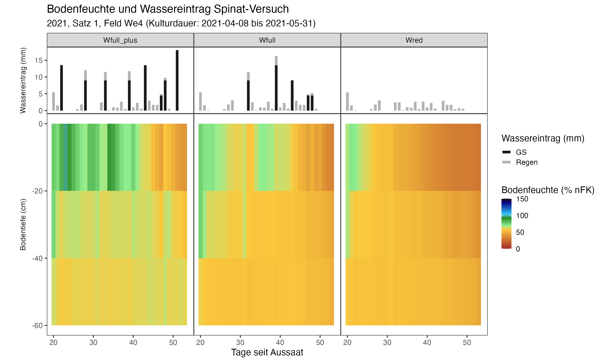

```{r setoptions, echo = FALSE, include=FALSE}
knitr::opts_chunk$set(warnings=FALSE, message = FALSE, cache=TRUE)
```


```{r echo=FALSE, message=FALSE, warning=FALSE}
library(DBI)
library(data.table)
library(dtplyr)
library(dplyr)
library(ggplot2)
library(lubridate)
library(ggnewscale)
library(tidyr)
```

### Tensiometer-Daten, Wetter und Bewasserung aus SQLite-Datenbank lesen.
```{r}
# Verbindung zur Datenbanl herstellen:
path0 <- "GeoSenSys2020/Data_2020/Database_Protokolle/Database_CSV_Tabellen_DLR/DLR_GeoSenSys_V1.db"
# Verbindung zur Datenbanl herstellen:
path1 <- ifelse(Sys.info()["user"] == "samantha_machgu",
                "~/Documents/Mac_Github/", 
                "../../"
)
db <- paste0(path1, path0) # DB in other R-Project
db1 <- dbConnect(RSQLite::SQLite(), db)
```


```{r}
# Query fuer Tensiometer-Datensatz
query <- "SELECT
        Spinat_Saetze.satz_id,
      --  Varianten.variante_acronym,
        Varianten.variante_H2O,
        Parzellen.wiederholung,
        Tensiometer.zeit_messung,
        Tensiometer.tensio_id,
        
        julianday(date(datetime(Tensiometer.zeit_messung, 'unixepoch'))) - julianday(date('1970-01-01', Spinat_Saetze.datum_aussaat || ' days')) AS tage_seit_aussaat,

        Tensiometer.B0020_nFK_prozent,
        Tensiometer.B2040_nFK_prozent,
        Tensiometer.B4060_nFK_prozent

        FROM Tensiometer
        LEFT JOIN Parzellen ON Tensiometer.parzelle_id = Parzellen.parzelle_id
        LEFT JOIN Varianten ON Parzellen.variante_id = Varianten.variante_id
        LEFT JOIN Spinat_Saetze ON Varianten.satz_id = Spinat_Saetze.satz_id
        WHERE Varianten.variante_N = 'N100' ;" #zunächst nur fuer Stickstoff-vollversorgte Varianten
tensio <- dbGetQuery(db1, query)

```

```{r}
#### Query fuer Wetter-Daten:
query2 <- "SELECT
        Wetter.satz_id,
        Wetter.datum_wetter,
        Wetter.datum_wetter - Spinat_Saetze.datum_aussaat AS tage_seit_aussaat,
        Wetter.niederschlag_mm
        FROM
        Wetter
        LEFT JOIN Spinat_Saetze ON Wetter.satz_id = Spinat_Saetze.satz_id"

wetter <- dbGetQuery(db1, query2) %>% # Niederschlag aller Saetze einlesen
    mutate_at("datum_wetter", ~ as_date(.))

## Wetter für Save:
query2a  <- "SELECT *  FROM Wetter;"
wetter2 <- dbGetQuery(db1, query2a) %>% # Niederschlag aller Saetze einlesen
    mutate_at("datum_wetter", ~data.table::as.IDate(.)) %>%
    mutate_at("datum_wetter", ~as_date(.)) %>%
    arrange(wetter_id)
```

```{r}
# Query fuer Bewaesserungs-Datensatz
query3 <- "SELECT DISTINCT
        bewaesserung_id,
        Spinat_Saetze.satz_id,
        Varianten.variante_H2O,
        Bewaesserung.datum_bewaesserung,
        Bewaesserung.wassermengen_mm

        FROM Bewaesserung

        LEFT JOIN Spinat_Saetze ON Bewaesserung.satz_id = Spinat_Saetze.satz_id
        LEFT JOIN Varianten ON Bewaesserung.variante_H2O = Varianten.variante_H2O AND Bewaesserung.satz_id = Spinat_Saetze.satz_id

        WHERE Varianten.variante_N = 'N100' 
"
bewaesserung <- dbGetQuery(db1, query3) %>% # Bewaesserung aller Saetze einlesen
    mutate_at("datum_bewaesserung", ~ as_date(.)) %>%
    rename(bewaesserung_mm = wassermengen_mm)
```


```{r}
##Für Plot
query4  <- "SELECT
            satz_id,
            datum_aussaat,
            datum_ernte
            FROM 
            Spinat_Saetze"
saetze_ausaat <- dbGetQuery(db1, query4)
saetze_ausaat <- saetze_ausaat %>% 
    mutate(across(starts_with("datum"), ~as_date(.)))

dbDisconnect(db1) # Verbindung zur Datenbank beenden
rm(db, db1, path1, query, query2, query3) # Helfer-Objekte loeschen
```

### Daten formatieren und Tagesmittelwerte der Bodensaugspannung berechnen
```{r}
tensio <- tensio %>%
    # Datum formatieren und Tagesmittelwerte bilden
    mutate_at("zeit_messung", ~ as_datetime(.) %>%
                  format.Date(., format = "%Y-%m-%d") %>% # für Tages-Mittelwert
                  as_date(.)) %>% # wieder in Datum (class) umformen
    # Faktorstufen sortieren (für Grafik)
    mutate_at("variante_H2O", ~ factor(., levels = c("Wfull_plus", "Wfull", "Wred", "ANNI", "GS_80_prozent", "GS_100_prozent"))) %>%
    group_by(satz_id, variante_H2O, wiederholung, zeit_messung, tage_seit_aussaat) %>%
    summarise(across(c(starts_with("bodensaugspannung"), ends_with("nFK_prozent")), 
                     ~ round(mean(., na.rm = TRUE), digits = 2)), .groups = "drop")
```

#DF speichern für A3_1 Tabelle erstellen:
```{r}
tensio_save <- tensio %>%
    #select(satz_id, variante_H2O, wiederholung, zeit_messung) %>%
    left_join(wetter2, by = c("satz_id", "zeit_messung" = "datum_wetter")) %>%
    left_join(bewaesserung, by = c("satz_id", "variante_H2O",#"wiederholung",
                                   "zeit_messung" = "datum_bewaesserung"
    )) %>% 
    mutate(across("bewaesserung_mm", ~ifelse(is.na(.), 0,.))) %>%
    select(-wetter_id)

#names(tensio_save)
file1 <- paste0("../data/derived_data/A1b_tabelle_", 
                format.Date(Sys.Date(), "%Y%m%d"), 
                ".csv")
file1
##fwrite(x = tensio_save, file = file1)
```


### Tabelle formatieren für ggplot
```{r}
tensio_melted <- tidyr::pivot_longer(tensio,
                                     cols = contains("nFK"),
                                     names_to = "Bodentiefe",
                                     values_to = "nFK_prozent"
) %>%
    mutate(Bodentiefe = substr(Bodentiefe, 4,5) %>% as.numeric()) %>%
    mutate(kategorie = factor("nFK", levels = c("wasserinput", "nFK")))
```


### Wetter- und Bewässerungsdaten formatieren und zusammenführen
```{r}
# Bewaesserung und Niederschlag in eine Tabelle zusammenfuehren
wasser_gesamt <- tensio %>%
    select(satz_id, variante_H2O, wiederholung, zeit_messung) %>%
    left_join(wetter, by = c("satz_id","zeit_messung" = "datum_wetter")) %>%
    left_join(bewaesserung, by = c("satz_id", "variante_H2O",
                                   "zeit_messung" = "datum_bewaesserung"
    )) %>%
    mutate(across(c("bewaesserung_mm", "niederschlag_mm"), ~ifelse(is.na(.),0,.))) %>% 
    # Faktorstufen sortieren (für Grafik)
    tidyr::pivot_longer(
        cols = c("bewaesserung_mm", "niederschlag_mm"),
        names_to = "variable", values_to = "value"
    ) %>%
    mutate(kategorie = factor("wasserinput", levels = c("wasserinput", "nFK"))) %>%
    mutate_at("variante_H2O", ~ factor(., levels = c("Wfull_plus", "Wfull", "Wred", "ANNI", "GS_80_prozent", "GS_100_prozent")))


#stacked values anfuegen fuer plot:
stacked_bars_plot <- function(data, gruppen){
    data %>% 
        group_by_at(vars(gruppen)) %>%
        mutate_at("value", ~ifelse(is.na(.), 0, .)) %>% 
        mutate(value_stacked = cumsum(value)) %>% 
        mutate(value_min = ifelse(variable == "bewaesserung_mm", 0, value[1])) %>% 
        mutate_at(c("value_stacked", "value_min"),~ifelse( value == 0, NA, .)) %>%
        ungroup()
}

wasser_gesamt <- stacked_bars_plot(
    data = wasser_gesamt, 
    gruppen = c("kategorie", "satz_id", "variante_H2O",
                "wiederholung", "zeit_messung", "tage_seit_aussaat")
)
```

#Standardabweichung der Wiederholung //Keine Wdh für Tensiometer in Schifferstadt
###Daten
```{r, include=FALSE, eval=FALSE}
# tensio_sd <- tensio_melted %>% 
#     pivot_wider(id_cols = c("kategorie", 
#                             "satz_id", "variante_H2O",##
#                             "zeit_messung", "tage_seit_aussaat", "Bodentiefe"), 
#                 names_from = "wiederholung", values_from = "nFK_prozent") %>%
#     rowwise() %>%
#     mutate(nfK_sd = sd(c, na.rm = TRUE)) %>%  ##in Schifferstadt: immer nur Wdh c! ##c(a,b,c,d)
#     select(-c) %>% ##-a, -b, -c, -d
#     ungroup
# 
# wasser_gesamt_sd <- wasser_gesamt %>% 
#     filter(variable != "niederschlag_mm")  %>% 
#     #niederschlag_mm ausschließen, da alle Wiederholungen gleich.
#     pivot_wider(id_cols = c("kategorie",
#                             "satz_id", "variante_H2O", ##
#                             "variable", "zeit_messung", "tage_seit_aussaat"), 
#                 names_from = "wiederholung", values_from = "value") %>%
#     rowwise() %>%
#     mutate(wasser_sd = sd(c, na.rm = TRUE)) %>% 
#     mutate_at("wasser_sd", ~ifelse(.==0, NA,.)) %>%
#     select(-c) %>%
#     ungroup
```

# NAs approximieren
```{r, include=FALSE, eval=TRUE}
library(zoo)
tensio_melted <-  tensio_melted %>% 
    group_by(satz_id, variante_H2O, wiederholung, Bodentiefe, kategorie) %>%
    mutate(across(nFK_prozent, ~na.approx(., na.rm = FALSE)))
```


#Funktionen für nFK-Plot aus Skript sourcen:
```{r}
source("../scripts/nfk_plot_functions.R")
#plot_nfk
```


```{r, eval=FALSE, message=FALSE, warning=FALSE}
#Beispiel:
#px <- 
plot_nfk(satz_nr = 1, subtitle = "2020, Satz 1, Feld We1", wdh = FALSE, grafik = NULL) #grafik = "smooth")
# plot_nfk(satz_nr = 6, subtitle = "2021, Satz 1, Feld 6, Variante 'Wred'", 
#          wdh = TRUE, variante = "Wred", grafik = "smooth")

#ggsave(filename = "../graphics/X20cm_Schritte/nFK_2022_Satz1.png", plot = px, device = "png", width = 10, height = 6, dpi = 300)
```


#Plot-Funktion ausfuehren
```{r message=FALSE, eval=FALSE, warning=FALSE}
#c("smooth", NULL)
#grafik <- "smooth" #NULL #fuer 20cm-Schritte.
grafik <- NULL
```

```{r message=FALSE, eval=FALSE, warning=FALSE}
## Auskommentierte Sätze haben keine Tensiometer-Daten
p1 <- plot_nfk(satz_nr = 1, subtitle = "2020, Satz 1, Feld We1", wdh = FALSE, grafik = NULL) 
p2 <- plot_nfk(satz_nr = 2, subtitle = "2020, Satz 2, Feld We2", wdh = FALSE, grafik = grafik)
#p3 <- plot_nfk(satz_nr = 3, subtitle = "2020, Satz 3 (Eddy Co), Feld Ge5", wdh = FALSE, grafik = grafik)
#p4 <- plot_nfk(satz_nr = 4, subtitle = "2020, Satz 4 (Winter), Feld Mau9_lang", wdh = FALSE, grafik = grafik)
p5 <- plot_nfk(satz_nr = 5, subtitle = "2021, Satz 1, Feld We4", wdh = FALSE, grafik = grafik)
p6 <- plot_nfk(satz_nr = 6, subtitle = "2021, Satz 2, Feld We3", wdh = FALSE, grafik = grafik) 
#p7 <- plot_nfk(satz_nr = 7, subtitle = "2021, Satz 3 (Eddy Co), Feld Mue1", wdh = FALSE, grafik = grafik) 
#p8 <- plot_nfk(satz_nr = 8, subtitle = "2021, Satz 4 (Winter), Feld Mau9_kurz", wdh = FALSE, grafik = grafik) 
p9 <- plot_nfk(satz_nr = 9, subtitle = "2022, Satz 1, Feld We2", wdh = FALSE, grafik = grafik) 
p10 <- plot_nfk(satz_nr = 10, subtitle = "2022, Satz 2, Feld We1", wdh = FALSE, grafik = grafik) 
p11 <- plot_nfk(satz_nr = 11, subtitle = "2023, Satz 1, Feld We4", wdh = FALSE, grafik = grafik) 
p12 <- plot_nfk(satz_nr = 12, subtitle = "2023, Satz 2, Feld We3", wdh = FALSE, grafik = grafik) 
#p13 <- plot_nfk(satz_nr = 10, subtitle = "2023, Satz 3 (Eddy Co), Feld Ge8", wdh = FALSE, grafik = grafik) 

p1; p2; p5; p6; p9; p10; p11; p12  ##p10 fragwürdig (Datum reversed, 20-40cm nicht plausibel)
```

#Grafik speichern
```{r message=FALSE, eval=FALSE}

# path0 <- "../graphics/nFK_plots_DLR/X20cm_Schritte/"
#  file_list <- list(
# file1 = paste0(path0, "S1_2020_Satz_1", ".png"), 
# file2 = paste0(path0, "S2_2020_Satz_2", ".png"), 
# file3 = paste0(path0, "S5_2021_Satz_1", ".png"), 
# file4 = paste0(path0, "S6_2021_Satz_2", ".png"), 
# file5 = paste0(path0, "S9_2022_Satz_1", ".png"), 
# file6 = paste0(path0, "S10_2022_Satz_2", ".png"), 
# file7 = paste0(path0, "S11_2023_Satz_1", ".png"), 
# file8 = paste0(path0, "S12_2023_Satz_2", ".png")
# 
# )
# 
# purrr::map2(file_list, list(p1,p2,p5,p6,p9,p10,p11,p12),
#             ~ggsave(filename = .x, plot = .y, device = "png", width = 10, height = 6, dpi = 300)
# )

# rm(p2,p3,p4,p5,p6,p7,p8,p9,p10)
```


\
\

\
\

\
\

\
\

\
\

\
\

\
\

\
\


