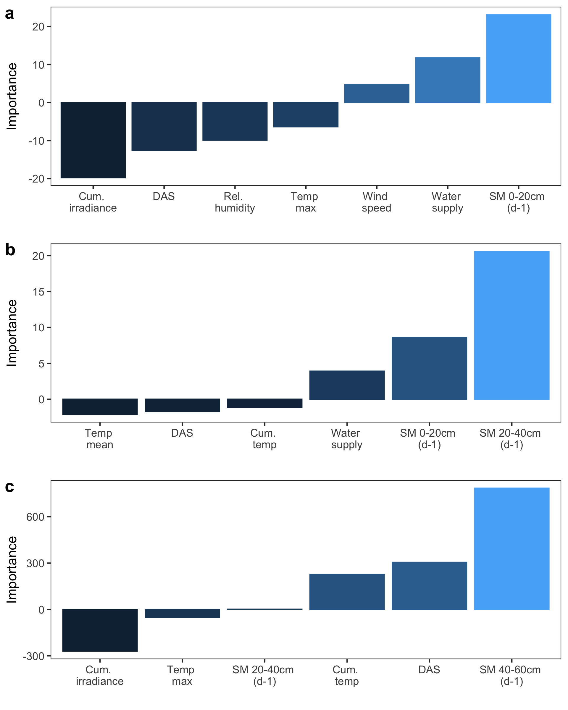

```{r}
rm(list = ls())
#Daten der erstellen Modelle (Ergebnis von unten)
#load("../data/derived_data/Model1/RData_ANNI20220511.RData") 
```
\
### Bibliotheken laden
```{r message=FALSE, warning=FALSE, include=FALSE}
library(data.table)
library(dplyr)
library(ggplot2)
library(purrr)
library(lubridate)
#library(tidyr)
library(neuralnet)
```
\
### Input-Tabelle laden (aus A3_Tabelle_erstellen.RMD)
```{r}
input_tabelle <- data.table::fread(
    "../data/derived_data/input_tabelle_2020_2021_20220504.csv", 
    sep = ";", dec = ".") %>% as_tibble()
```
\
### nFK vom Vortag als Input ausweisen:
```{r}
input_tabelle <- 
    input_tabelle %>%
    ## nFK vom Vortag: 
    mutate(T0020_nFK_Vortag = c(NA,T0020_nFK[1:(n()-1)]),
           T2040_nFK_Vortag = c(NA,T2040_nFK[1:(n()-1)]),
           T4060_nFK_Vortag = c(NA,T4060_nFK[1:(n()-1)])) %>%
    ## mm vom Vortag:
    mutate(T0020_mm_Vortag = c(NA,T0020_mm[1:(n()-1)]),
           T2040_mm_Vortag = c(NA,T2040_mm[1:(n()-1)]),
           T4060_mm_Vortag = c(NA,T4060_mm[1:(n()-1)])) %>%
    
    #Zielgroese: available water capacity (%nFK oder AWC) oder soil water content (mm)
    mutate(SM0020 = T0020_nFK,
           SM2040 = T2040_nFK,
           SM4060 = T4060_nFK,
           SM0020_d1 = T0020_nFK_Vortag,
           SM2040_d1 = T2040_nFK_Vortag,
           SM4060_d1 = T4060_nFK_Vortag)

# mutate(SM0020 = T0020_mm,
#        SM2040 = T2040_mm,
#        SM4060 = T4060_mm,
#        SM0020_d1 = T0020_mm_Vortag,
#        SM2040_d1 = T2040_mm_Vortag,
#        SM4060_d1 = T4060_mm_Vortag)

plot_axis_titles <- "AWC (%)"
```
\
### Wassereintrag aus P + Bewässerung berechnen. Benötigte Variablen selektieren.
```{r}
target <- c("SM0020","SM2040","SM4060", #yyy
            "SM0020_d1", "SM2040_d1", "SM4060_d1", #yyy previous day
            "tage_seit_aussaat", 
            "bewaesserung_mm", "niederschlag_mm", 
            "Tempsum", "Tmax_gradC", "Tmin_gradC", "Tmean_gradC", 
            "relLuftfeuchte_mean_prozent", "relLuftfeuchte_min_prozent", 
            "Gobsum", "globalstrahlung_Mj_m2", 
            "windgeschwindigkeit_m_s"
)

input_df <- input_tabelle %>%
    filter(satz_id!=5|variante_H2O!="Wfull_plus") %>% ############# Eine Variante herausnehmen!
    select(satz_id, variante_H2O,wiederholung, target) %>%
    rowwise() %>%
    mutate(wasser_input = sum(niederschlag_mm, bewaesserung_mm, na.rm = TRUE)) %>%
    ungroup %>%
    mutate(wasser_input_Vortag = c(NA,wasser_input[1:(n()-1)])) %>%
    select(-niederschlag_mm, -bewaesserung_mm, -wasser_input) %>%
    tidyr::drop_na()

idx_saetze <- input_df %>% select(satz_id, variante_H2O)
input_df <- input_df %>% select(-satz_id, -variante_H2O)

```
\
### Datensatz skalieren --> notwendig als Input für ANN
```{r}
# The predictor vars must be scaled data for the ANN fitting
df_tmp <-  input_df %>% select(-wiederholung)
input_df.scaled <- data.table::as.data.table(scale(df_tmp))
rm(df_tmp)
# # response var must be scaled to [0 < resp < 1]
input_df.scaled$SM0020 <- input_df$SM0020
input_df.scaled$SM2040 <- input_df$SM2040
input_df.scaled$SM4060 <- input_df$SM4060

input_df.scaled <- input_df.scaled %>%
    mutate_at(c("SM0020", "SM2040", "SM4060"),
              ~scale(., center = min(., na.rm = TRUE),
                     scale = max(., na.rm = TRUE) - min(., na.rm = TRUE)))

```
\
### Index für Trainings- und Test-Datensatz
```{r}
# Train-test split
set.seed(123)
idx <- sample(1:nrow(input_df.scaled), size = tail(nrow(input_df.scaled)*0.7) )
train <- input_df.scaled[idx,]
test <- input_df.scaled[-idx,]
```
\
### ANNI erstellen
## 1. Modell für 0-20cm Tiefe
```{r}
#original: (paper)
set.seed(1234)
nn0020=map(1:20,
           ~neuralnet(SM0020 ~
                          tage_seit_aussaat+
                          #  Tempsum+
                          Tmax_gradC+
                          #  Tmin_gradC+
                          ##  Tmean_gradC+
                          wasser_input_Vortag+
                          SM0020_d1+
                          # SM2040_d1+
                          # SM4060_d1+
                          ##  relLuftfeuchte_mean_prozent+
                          relLuftfeuchte_min_prozent+
                          Gobsum +
                          #  globalstrahlung_Mj_m2 +
                          windgeschwindigkeit_m_s,
                      
                      data = train, hidden=10, act.fct = "logistic", rep = 1,
                      linear.output = F, algorithm = "rprop+", #"rprop+",#"backprop"
                      learningrate = 0.01, threshold=0.01, stepmax = 1e+6)
)
```

## gesamtes Modell für alle Schichten:
```{r}
# set.seed(1234)
# nn=neuralnet(SM0020 + SM2040 ~ 
#                  tage_seit_aussaat+ 
#                  Tempsum+
#                  Tmax_gradC+
#                  Tmin_gradC+
#                  Tmean_gradC+
#                  wasser_input_Vortag+
#                  SM0020_d1+
#                  SM2040_d1+
#                  SM4060_d1+
#                  #  relLuftfeuchte_mean_prozent+
#                  relLuftfeuchte_min_prozent+
#                  Gobsum +
#                  # globalstrahlung_Mj_m2 +
#                  windgeschwindigkeit_m_s,
#              
#              data = train, hidden=10, act.fct = "logistic", rep = 1,
#              linear.output = F, algorithm = "backprop", 
#              learningrate = 0.01, threshold=0.01, stepmax = 1e+6)
```

## 2. Modell für 20-40cm Tiefe
```{r}
set.seed(1234)

nn2040=map(1:20, 
           ~neuralnet(SM2040 ~ 
                          tage_seit_aussaat+ 
                          Tempsum+ ###
                          ## Tmax_gradC+
                          ## Tmin_gradC+ ##
                          Tmean_gradC+ ##
                          wasser_input_Vortag+ ###
                          SM0020_d1+
                          SM2040_d1,
                      #  SM4060_d1+ #
                      #  relLuftfeuchte_mean_prozent+ #
                      #  relLuftfeuchte_min_prozent+ #
                      #  Gobsum + #
                      #  globalstrahlung_Mj_m2 + #
                      #  windgeschwindigkeit_m_s, #
                      
                      data = train, hidden=10, act.fct = "logistic", rep = 1,
                      linear.output = F, algorithm = "rprop+", #backprop
                      learningrate = 0.01, threshold=0.01, stepmax = 1e+6)
)
```

## 3. Modell für 40cm - 60 Tiefe
```{r}
set.seed(1234)

nn4060=map(1:20, 
           ~neuralnet(SM4060 ~ 
                          #        T4060_Auswaschung_mm_Vortag + ##Auswaschung eingefügt!!
                          #        T2040_Auswaschung_mm_Vortag + ##Auswaschung eingefügt!!
                          #        freier_Speicher_SM2040_d1 + 
                          tage_seit_aussaat+ 
                          Tempsum+ 
                          Tmax_gradC+
                          #        Tmin_gradC+ 
                          #        Tmean_gradC+ 
                          #        wasser_input_Vortag+ 
                          #        SM0020_d1+
                          SM2040_d1+
                          SM4060_d1+ 
                          #       relLuftfeuchte_mean_prozent+ 
                          #relLuftfeuchte_min_prozent+ 
                          Gobsum,
                      #       globalstrahlung_Mj_m2 + 
                      #       windgeschwindigkeit_m_s, 
                      
                      data = train, hidden=c(10,5), act.fct = "logistic", rep = 1,
                      linear.output = F, algorithm = "rprop+", #backprop
                      learningrate = 0.01, threshold=0.01, stepmax = 1e+6)
)
```
#Chose best repetition
```{r}

nn_list_extract <- function(nn_list){
    # #nn_list <- nn0020 
    # #nn_list <- nn2040
    # nn_list <- nn4060
    errors1 <- map_dbl(nn_list, ~.x$result.matrix[1,])
    best_rep <-  which.min(errors1)
    #cat("Best Repetition ist: #", best_rep)
    nn <- nn_list[[best_rep]]
    list(nn=nn)
}


nn0020_best <- nn_list_extract(nn_list = nn0020)#, target_y = "SM0020")
nn2040_best <- nn_list_extract(nn_list = nn2040)#, target_y = "SM2040")
nn4060_best <- nn_list_extract(nn_list = nn4060)#, target_y = "SM4060")

```

\
### Nodes plotten
```{r}
#for(i in c(nn0020_best,nn2040_best,nn4060_best)){
plot(nn4060_best[["nn"]],col.hidden = 'darkgreen', 
     col.hidden.synapse = 'darkgreen',
     show.weights = F,
     information = T,
     fill = 'lightblue', 
     #dimension = c(15,13),
     fontsize = 10,
     information.pos = 100
)
#     }
```
```{r}
for(i in 1:3){
    par(mar = c(0,0,0,0) )
    NeuralNetTools::plotnet(mod_in = list(nn0020_best, nn2040_best, nn4060_best)[[i]][["nn"]], 
                            max_sp = TRUE, pad_x = 0.6, cex_val = 0.8)
}
```

#obsolet: Olden variance pro repetition berechnen:
```{r}
#importance of variable per repetiton
olden_per_rep <- function(i, nn_list){
    new_name <- paste0("importance_",i)
    olden1 <- NeuralNetTools::olden(nn_list[[i]], bar_plot = FALSE) %>%
        rename(!!sym(new_name) := importance)
    olden1
}

olden_90_percentile <- function(all_olden_df){
    tt <- t(all_olden_df) %>% as_data_frame() 
    quantiles_olden <- map_df(tt, ~quantile(., probs = c(0.05,0.95)), .id="parameter") %>%
        set_names("parameter","lower", "upper")
    quantiles_olden
}


importance_0020 <- map(1:20, ~olden_per_rep(i = .x, nn_list = nn0020)) %>% bind_cols()
importance_2040 <- map(1:20, ~olden_per_rep(i = .x, nn_list = nn2040)) %>% bind_cols()
importance_4060 <- map(1:20, ~olden_per_rep(i = .x, nn_list = nn4060)) %>% bind_cols()


olden_90_0020 <-  olden_90_percentile(all_olden_df = importance_0020)
olden_90_2040 <-  olden_90_percentile(all_olden_df = importance_2040)
olden_90_4060 <-  olden_90_percentile(all_olden_df = importance_4060)

```


\
```{r}
labels1 <- c("Gobsum" = "Cum. \nirradiance",
             "relLuftfeuchte_min_prozent" = "Rel. \nhumidity",
             "SM0020_d1" = "SM 0-20cm \n(d-1)",
             "SM2040_d1" = "SM 20-40cm \n(d-1)",
             "SM4060_d1" = "SM 40-60cm \n(d-1)",
             "Tempsum" = "Cum. \ntemp",
             "tage_seit_aussaat" = "DAS",
             "Tmax_gradC" = "Temp \nmax",
             "Tmean_gradC" = "Temp \nmean",
             "wasser_input_Vortag" = "Water \nsupply",
             "windgeschwindigkeit_m_s" = "Wind \nspeed"
)
```


#Olden Plots:
```{r}

plots_olden <- map(list(nn0020_best=nn0020_best, nn2040_best=nn2040_best, nn4060_best=nn4060_best),
                   ~NeuralNetTools::olden(.x[["nn"]]) +
                       theme(#axis.text.x = element_text(angle = 90, hjust = 1, vjust = 0.5),
                           panel.grid = element_blank( )) +
                       scale_x_discrete("",
                                        #breaks = auswahl$parameter, 
                                        labels = labels1)
)
plots_olden

# Add: 90%-Range for olden for 20 repitions: 
# map(seq_along(plots_olden), ~plots_olden[[.x]] +
#         geom_errorbar(data = list(olden_90_0020,olden_90_2040,olden_90_4060)[[.x]], 
#                       aes(x = parameter, 
#                           ymin = lower, 
#                           ymax = upper), width = 0.2, col = "black"))
```

```{r, fig.width=6, fig.height=10}
p_olden_combined <- ggpubr::ggarrange(plotlist = plots_olden, ncol = 1, 
                                      align = "hv", labels = "auto")
# ggsave(plot = p_olden_combined, filename = "../graphics/Olden_combined.png", 
#        device = "png", width = 8*0.8, height = 10*0.8, dpi = 300)
```



#Olden einzeln erstellen:
```{r, eval=FALSE}
# #p1 <- NeuralNetTools::garson(nn) 
# p2 <- NeuralNetTools::olden(nn)
# ## Beu Multi-Outpu-Data:
# #p2 <- NeuralNetTools::olden(nn, "SM2040")
# # NeuralNetTools::olden(nn, bar_plot = FALSE) #for values
# #p1.2 <- p1 + theme(axis.text.x = element_text(angle = 90, hjust = 1, vjust = 0.5))
# p2.2 <- p2 + theme(axis.text.x = element_text(angle = 90, hjust = 1, vjust = 0.5))
# p2.2
```
NeuralNetTools::olden(nn) zeigt auch Vorzeichen: Einige Parameter sind kontraproduktiv für das Neuronale Netzwerk. Sie wurden daher in einem weiteren Schritt entfernt.
https://www.jstatsoft.org/article/view/v085i11


#Tabelle "actual and predicted values" df1 an nn_nbest_list anfügen
```{r}

df_act_pred <- function(nn, target_y, test_data, input_raw, input_scaled){
    y_raw <- input_raw %>% pull(target_y)
    maxy <-max(y_raw)
    miny <-min(y_raw)
    
    #Nur Test-Daten
    # Predict <- compute(nn$nn,test_data)
    # Predict_ <- Predict$net.result*(maxy-miny)+miny
    # test.r <- (test_data %>% pull(target_y))*(maxy-miny)+ miny
    # MSE.nn <- sum((test.r - Predict_)^2, na.rm = TRUE)/nrow(test_data)
    # RMSE.nn <- sqrt(MSE.nn)
    
    #Alle Daten
    predict_all <- compute(nn$nn, input_scaled)
    predict_all_net <- predict_all$net.result*(maxy-miny)+miny
    test.r <- (input_scaled %>% pull(target_y))*(maxy-miny)+ miny
    MSE.nn <- sum((test.r - predict_all_net)^2, na.rm = TRUE)/nrow(test_data)
    RMSE.nn <- sqrt(MSE.nn)
    
    #Gemessene und ANN-berechnete Werte in eine Tabelle eintragen
    df1 <- as.data.table(data.frame(actual_value = y_raw, 
                                    predicted_value = predict_all_net,
                                    input = "alle_Daten")) %>% bind_cols(idx_saetze)
    
    #Modellguete R2:
    r2 = summary(lm(predicted_value ~actual_value, data = df1))$adj.r.squared
    #return(df1)
    output <- list(df1=df1, mse=MSE.nn, rmse = RMSE.nn, r2=r2)
    return(output)
}

### Beispiel-Input:
# nn = nn0020_best
# target_y <- "SM4060"
# test_data <- test
# input_raw <- input_df
# input_scaled <- input_df.scaled

### erstelle Daten löschen (Workspace aufräumen)'
#rm(nn, target_y, test_data, input_raw, input_scaled, Predict, y_raw, maxy, miny, Predict_, test.r, MSE.nn, predict_all,predict_all_net, df1 )

tmp1 <- df_act_pred( nn = nn0020_best, target_y = "SM0020", test_data = test, 
                     input_raw = input_df, input_scaled = input_df.scaled)
tmp2 <- df_act_pred( nn = nn2040_best, target_y = "SM2040", test_data = test, 
                     input_raw = input_df, input_scaled = input_df.scaled)
tmp3 <- df_act_pred( nn = nn4060_best, target_y = "SM4060", test_data = test, 
                     input_raw = input_df, input_scaled = input_df.scaled)


nn0020_best[c("df1", "mse", "rmse", "r2")] <- tmp1
nn2040_best[c("df1", "mse", "rmse", "r2")] <- tmp2
nn4060_best[c("df1", "mse", "rmse", "r2")] <- tmp3

rm(tmp1, tmp2, tmp3)
```


```{r}
plot_measured_predicted <- function(data){
    
    p1 <- ggplot(data, aes(actual_value, predicted_value,
                           color=as.factor(satz_id))) + 
        geom_point() + 
        geom_abline(slope = 1, intercept = 0, color = "red")+
        ylab(paste("ANN predicted", plot_axis_titles)) +
        xlab(paste("Actual", plot_axis_titles)) +
        theme_bw() + 
        coord_fixed() + 
        theme(panel.grid = element_blank(),
              legend.position = "bottom") +
        scale_color_discrete("Spinat_satz")
    p1
}

map(list(nn0020_best, nn2040_best, nn4060_best),
    ~plot_measured_predicted(data = .x[["df1"]]))
```
#Lm pro Bodentiefe:
```{r}
all_predicted <- map_df(list(S0020_cm = nn0020_best, S2040_cm = nn2040_best, S4060_cm = nn4060_best),
                        ~.x[["df1"]], .id = "BodenTiefe")
p_all <- plot_measured_predicted(data = all_predicted) + aes(col=BodenTiefe, group = BodenTiefe) +
    geom_smooth(method = "lm", col="black") +
    scale_color_discrete("Soil depth:") +
    theme(legend.position = "right")

p_all
```
```{r}
# ggsave(plot = p_all, "../graphics/ANNI_actual_predicted_all.png", device = "png",
#        width = 5, height = 5, dpi = 300)
```


#Plot: Measured vs predicted: lm mit Modellgüte r2, mse oder rmse
```{r}
model_performance_labels <- map_df(list(S0020_cm = nn0020_best, 
                                        S2040_cm = nn2040_best, 
                                        S4060_cm = nn4060_best), 
                                   ~data.frame(.x[c("mse", "rmse", "r2")]), .id = "BodenTiefe") %>% 
    mutate(R2_label =  paste0("R2 = ", round(r2,2)),
           MSE_label = paste0("MSE = ", round(mse, 2)),
           RMSE_label = paste0("RMSE = ", round(rmse, 2))
    )

#Manuell aus Ergebnis ausgelesen:
# text_r2 <- data.frame(BodenTiefe = c("S0020_cm", "S2040_cm", "S4060_cm"),
#                       R2 = c(0.97, 0.97, 0.96),
#                       MSE = c(2.87, 1.05,0.34)) %>%
#     mutate(R2_label =  paste0("R2 = ", R2),
#            MSE_label = paste0("MSE = ", MSE)
#     ) 

#Plot erstellen
p_lm_2 <- ggplot(all_predicted, aes(actual_value, predicted_value)) + 
    geom_point() + 
    geom_abline(slope = 1, intercept = 0, color = "grey70")+
    geom_smooth(method = "lm", col="red", linetype = 1) +
    facet_grid(BodenTiefe~.) +     
    ylab(paste("ANN predicted", plot_axis_titles)) +
    xlab(paste("Measured", plot_axis_titles)) + 
    
    #Modell-Guete Werte:
    ggpubr::stat_regline_equation(label.y = 120, aes(label = ..rr.label..), size = 3) + #r2-label
    #geom_text(data = model_performance_labels, aes(x=25, y = 120, label = R2_label, parse = TRUE), size = 3, hjust = 0) + 
    geom_text(data = model_performance_labels, aes(x=25, y = 100, label = RMSE_label), size = 3, hjust = 0) + 
    
    theme_bw() + 
    coord_fixed() + 
    theme(panel.grid = element_blank())
p_lm_2
```


#Zeireihe plotten:
```{r}
add_DAS_to_output_df <- function(data){
    data$tage_seit_aussaat <- (input_df %>% pull(tage_seit_aussaat))
    data$wiederholung <- (input_df %>% pull(wiederholung))
    data
}

all_df1 <- map_df(list(S0020_cm = nn0020_best, S2040_cm = nn2040_best, S4060_cm = nn4060_best),
                  ~add_DAS_to_output_df(data = .x[["df1"]]), .id = "BodenTiefe")
```


```{r, fig.width=6, fig.height=6}
p_vertical_func <- function(.satz_id, .variante_H2O, .wiederholung ){
    p1 <- ggplot(all_df1 %>% filter(satz_id == .satz_id, #2021-S2
                                    variante_H2O == .variante_H2O, 
                                    wiederholung == .wiederholung), 
                 aes(tage_seit_aussaat)) + 
        geom_line(aes(y=actual_value, col = "actual_value")) + 
        geom_line(aes(y=predicted_value, col = "predicted_value")) + 
        geom_point(aes(y=actual_value, col = "actual_value")) + 
        geom_point(aes(y=predicted_value, col = "predicted_value")) + 
        facet_grid(BodenTiefe~.)+
        scale_color_manual("", values = c("actual_value" = "black",
                                          "predicted_value" = "red"), 
                           labels = c("actual_value" = "Measured", 
                                      "predicted_value" = "Predicted")) +
        xlab("Days after seeding") + ylab(plot_axis_titles) + 
        theme_bw()+
        theme(panel.grid = element_blank(), legend.position = "bottom")
    p1
}
#Grafik aus Paper:
p_vertical <- p_vertical_func(.satz_id =4, #2021-S2,
                              .variante_H2O = "Wfull_plus", 
                              .wiederholung = "a")
p_vertical
```
```{r}
#reduzierte Variante!
p_vertical_func(.satz_id =4, #2021-S2,
                .variante_H2O = "Wred", 
                .wiederholung = "a")

p_vertical_func(.satz_id =4, #2021-S2,
                .variante_H2O = "Wfull", 
                .wiederholung = "a")

p_vertical_func(.satz_id =5, #2021-S2,
                .variante_H2O = "Wfull", 
                .wiederholung = "d")
```
```{r}
#aben <- expand.grid(wiederholung = letters[1:4], variante_H2O = c("Wred", "Wful", "Wfull_plus"), satz_id = 2:5)
df_eingaben <- all_df1 %>% group_by(satz_id, variante_H2O, wiederholung) %>% summarise(n = nrow(satz_id))

map(1:nrow(df_eingaben), 
    ~p_vertical_func(.satz_id = df_eingaben$satz_id[.x], 
                     .variante_H2O = df_eingaben$variante_H2O[.x], 
                     .wiederholung = df_eingaben$wiederholung[.x]))
```


```{r}
# ggsave(plot = p_vertical, "../graphics/ANNI_actual_predicted_vertical.png", device = "png",
#        width = 6, height = 5, dpi = 300)
```

```{r}
plot_combined <- ggpubr::ggarrange(plotlist = list(p_vertical,p_lm_2), 
                                   common.legend = TRUE, widths = c(2,1),
                                   legend = "bottom", labels = "auto") +
    theme(plot.background = element_rect(fill = "white", colour = "white"))
plot_combined
```
```{r}
#ggsave(plot = plot_combined, "../graphics/ANNI_actual_predicted_plot_combined_20220804_b.png",device = "png", width = 8, height = 5, dpi = 600)
```


#Auswertung für Vortrag:


### Änderung der nFK pro Tag
# Hisotgram
```{r}
nfk_change <- all_df1 %>% group_by(satz_id, variante_H2O, wiederholung, BodenTiefe) %>% 
    transmute(nFK_change_1d = c(NA, diff(actual_value)),
              tage_seit_aussaat = tage_seit_aussaat,
              BodenTiefe=BodenTiefe)


ggplot(nfk_change %>% filter(nFK_change_1d <0 & tage_seit_aussaat > 20), aes(x = nFK_change_1d, fill = satz_id)) + 
    geom_histogram() + 
    facet_grid(BodenTiefe~variante_H2O, scales = "free_y")
```
#Nach Datum > 20 DAS
```{r}
ggplot(nfk_change %>% filter(tage_seit_aussaat > 20), aes(x = tage_seit_aussaat, y = nFK_change_1d, color = as.factor(satz_id))) + 
    stat_summary(geom = "line", fun = "mean") + 
    #geom_line() + 
    facet_grid(BodenTiefe~variante_H2O)
```


```{r}
ggplot(all_df1 %>% filter(actual_value < 70), 
       aes(x = actual_value, y = predicted_value, color = as.factor(satz_id), shape = wiederholung)) + 
        geom_abline(slope = 1, intercept = 0) + 
    stat_summary(geom = "point", fun = "mean") + 
    #geom_line() + 
        ggpubr::stat_regline_equation(label.y = 65, aes(label = ..rr.label..), size = 3) + #r2-label
    facet_grid(BodenTiefe~variante_H2O) + 
    scale_y_continuous(limits = c(50,70)) +  scale_x_continuous(limits = c(50,70))+
    theme_bw()+
    theme(panel.grid = element_blank())

```


```{r}
ggplot(all_df1 %>% filter(actual_value < 70), 
       aes(x = actual_value, y = predicted_value)) + 
        geom_abline(slope = 1, intercept = 0) + 
    stat_summary(geom = "point", fun = "mean") + 
        ggpubr::stat_regline_equation(label.y = 65, aes(label = ..rr.label..), size = 3) + #r2-label
    scale_y_continuous(limits = c(50,70)) +  scale_x_continuous(limits = c(50,70))+
    theme_bw()+
    theme(panel.grid = element_blank())
```


